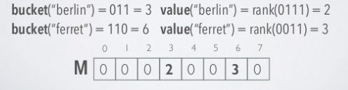
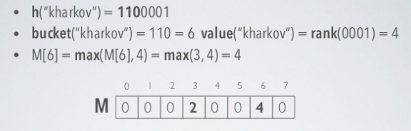
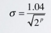

<!-- TOC -->
- [2. Khái niệm](#2-khái-niệm)
   - [2.1 Cấu trúc dữ liệu](#21-cấu-trúc-dữ-liệu)        
      - [Tính chất của Probabilistic data structures](#tính-chất-của-probabilistic-data-structures)         
      - [Bloom Filters](#bloom-filters) 
      - [Cuckoo Filters](#cuckoo-filters) 
      - [Count Min Sketch](#count-min-sketch)         
      - [Hyper log log](#hyper-log-log)         
      - [Trie](#trie)     
   - [2.2 Design pattern](#22-design-pattern)        
      - [Factory pattern](#factory-pattern)         
      - [Strategy Pattern](#strategy-pattern)        
      - [Singleton](#singleton)         
      - [Adapter Pattern](#adapter-pattern)         
      - [Composite Pattern](#composite-pattern)     
   - [2.3 Nguyên tắc lập trình](#23-nguyên-tắc-lập-trình)         
      - [SOLID](#solid)             
         - [Single responsibility principle](#single-responsibility-principle)             
         - [Open-Closed principle](#open-closed-principle)        
         - [Liskov substitution principle](#liskov-substitution-principle)             
         - [Interface segregation principle](#interface-segregation-principle)             
         - [Dependency inversion principle](#dependency-inversion-principle)        
      - [DRY](#dry)         
      - [KISS](#kiss)         
      - [YAGNI](#yagni)         
      - [Do the simplest thing that could possibly work](#do-the-simplest-thing-that-could-possibly-work)         
      - [Clean code](#clean-code) 
- [3. Bài tâp](#3-bài-tâp)    
   - [3.1 Predictive text](#31-predictive-text)     
   - [3.2 Hash Tables](#32-hash-tables)     
   - [3.3 Tính thời gian xử lý khiếu nại](#33-tính-thời-gian-xử-lý-khiếu-nại) <!-- /TOC -->
# 2. Khái niệm

## 2.1 Cấu trúc dữ liệu

### Tính chất của Probabilistic data structures

Probabilistic data structures là một nhóm tập hợp các cấu trúc dữ liệu

Khi ta làm việc trên các tập dữ liệu lớn, ta thường có một số thao tác cơ bản như kiểm tra số phần tử  phân biệt trong dữ liệu, phần từ được truy cập thường xuyên hoặc phần tử có tồn tại trong tập dữ liệu hay không. Cách tiếp xúc đơn giản dễ sử dụng nhất là sử dụng HashSet hoặc HashTable. Nhưng khi dữ liệu quá lớn, cấu trúc dữ liệu sẽ không khả thi bởi vì dữ liệu quá lớn để lưu được trong bộ nhớ.

Probabilistic data structures cung cấp kết quả gần đúng với câu trả lời của bài toán và cách để  xấp xỉ các dự đoán đó. Chúng cực kì hữu ích đối với tập dữ liệu lớn và streaming application. Nói chung các cấu trúc dữ liệu này sử dụng hàm băm  ngẫu nhiên để đưa phần tử vào các tập dữ liệu. Đụng độ có thể được bỏ qua nhưng lỗi có thể được kiểm soát tốt để không vượt quá ngưỡng chịu đựng. Lợi ích mà chúng mạng lại.

- Sử dụng ít bộ nhớ (bạn có thể  cấu hình chúng sử dụng bao nhiêu)

- Chúng có thể chạy song song

- Chúng có thời gian truy vấn không thay đổi.

- Hỗ trợ với các phép toán trên các phần tử  phân biệt trên tập dữ liệu.

### Bloom Filters

Trong trường hợp tạo một tạo khoản mới, khi nhập tài khoản đã tồn tại ta sẽ nhận được thông báo rằng tài khoản đã tồn tại vui lòng nhập tài khoản mới. Nhưng để làm thế nào để có thể kiểm tra tìm kiếm xem tài khoản đã tồn tại trong cơ sở thì có một vài cách đơn giản như sau dùng linear search, binary search nhưng các thuật toán này không hiệu quả. Nhưng Bloom Filters có thể làm được điều này.

Bloom Filter là một  cấu trúc dữ liệu `space-efficient probabilistic` được dùng cho việc kiểm tra phần tử  có nằm trong tập dữ liệu không. Như là việc kiểm tra tài khoản có tồn tại trong dữ liệu chưa. Việc đánh đổi hiệu suất của việc kiểm tra là kết quả có tính xác xuất sai lầm, được gọi là `False positive means`. Có nghĩa là tài khoản có tồn tại nhưng vẫn thông báo là hợp lệ.

Một số thuộc tính của Bloom Filters

- Có kích thước cố định có thể biểu diễn một tập dữ liệu với độ lớn tùy ý.

- Thêm một phần tử mới không bao giờ thất bại. Tuy nhiên tỉ lệ `Flase positive means` lại tăng, nếu cứ tiếp tục thêm vào thì khả năng kiểm tra luôn cho về kết quả đúng

- Xóa một phần tử khỏi Bloom Filters là không thể, bởi vì khi xóa một phần tử bằng cách loại bỏ một bài bit tại các vị trí được khởi tạo bởi hàm băm, có thể sẽ xóa một vài bit các phần tử khác.

Đầu tiên thì Bloom Filter sẽ khởi tạo một mảng bit có chiều dài cố định với các giá trị bên trong là 0.


Sau đó ta cần k số lượng hàm băm khác nhau để có thể băm các input vào tùng vị trí mảng đã khởi tạo. Khi muốn thêm chúng vào filter, số bit tại vị trí k tương đương với giá trị của các hàm băm h1(input), h2(input)...hk(input). Các vị trí sẽ được tính bởi các hàm băm tương ứng

Một ví dụ cụ thể như sau
ta có 3 hàm băm với giá trị đầu vào là "geeks"

```sh
h1(“geeks”) % 10 = 1
h2(“geeks”) % 10 = 4
h3(“geeks”) % 10 = 7
```

Do các giá trị tại hàm băm h1, h2, h3 lần lượt là 1,4,7 nên ta vị trí 1 4 7 có giá trị là 1 trong bảng giá trị


Vấn đề  `False positive means` được tạo ra khi có các bit khác trùng giá trị với một vài vị trí, khi được thêm vào càng nhiều đến một lúc nào đó sẽ bị trùng nên xảy ra vấn đề này. Tùy vào từng ứng dụng thì viêc này có thể chấp nhận được hoặc sẽ gây ra lỗi lớn.

Xác xuất để xảy ra `Flase positive means`  là: với kích thước mảng là m, k là số lượng hàm băm, và n là số lượng phần tử được thêm vào thì xác xuất là


### Cuckoo Filters

Là một cấu trúc dữ liệu `probabilistic data structure`, nó chỉ việc lưu trữ figherprint - một chuỗi bit được tạo ra từ các phần tử sử dụng hàm băm khi được thêm vào thay vì lưu cặp khóa giá trị.

Cuckoo Filters có mảng chứa các giá trị bit của fingerprints được gọi là b. Chúng cũng có `load` để mô tả phần trăm không gian mà bộ lộc đã lưu trữ. Số liệu này quan trọng cho việc phân tích để quyết định xem khi nào nên thay đổi kích thước của mảng lưu trữ.

Hỗ trợ cho việc kiểm tra phần tử có nằm trong mảng hay không. Nó tương tự như bloom filter cả hai đều hiệu quả về mặt thời gian và không gian lưu trữ. Cuckoo cũng có thể  có `false positive rates` với tỉ lệ thấp hơn 3%. Đều đăc biệt hơn blood filter là cuckoo filter hỗ trợ cho viêc xóa các phần tử trong tập dữ liệu. Viêc tìm kiếm khóa x trong tập dữ liệu đơn giản là tìm kiếm trong bảng băm fingerprint của x và trả về là đúng nếu trùng khớp với fingerprint được tìm kiếm trong bảng.

Ở cuckoo Hashing, mỗi khóa được hash bởi hai hàm băm, do đó giá trị tại khóa có thể được đăng kí tại một trong hai bucket. Chi tiết cụ thể như sau  

- Chèn khóa k vào

- Tính hàm băm của k, h(k) = k1 sử dụng hàm băm thứ 1
  
- Nếu bucket tại k1 trống thì đặt k1 tại đó

- Nếu bucket tại k1 đã được sử dụng thì sử dụng hàm băm thứ hai g(k1) = k2

- XOR k1 và k2 với nhau để có đưa giá trị tại bucket thứ 2

- Nếu tại bucket thứ 2 đã được sử dụng thì nó sẽ bị thay thế  và bị văng ra. Quá trình này lại tiếp tục đối với key vừa bị văng ra. Với tình trạng như vậy thì có thể gặp tình trạng lặp vô tận khi xóa hoặc di chuyển khóa. Bởi vì đó, ta cần phải theo dõi mỗi bucket đã truy cập, nếu có cùng một bucket được truy cập 2 lần thì đó là một chu kì bị lặp đi lặp lại. Có một vài cách để khác phục đều này là xây dựng lại bảng băm hoặc làm cho mảng chứa lớn hơn hoặc thay đổi hàm băm.

### Count Min Sketch

là một cấu trúc dữ liệu cho phép đếm các giá trị khác nhau trong tập dữ liệu như là đếm các địa chỉ IP khác nhau kết nối đến server. Ta có thể hoàn thành đều này mặc dù sử dụng ít không gian hơn để lưu trữ số lượng các phần tử, với viêc đánh đổi rằng kết quả của phép đếm đôi khi có thể bi sai lệch. Nhưng ta có thể điều chỉnh các tham số của cấu trúc dữ liệu này để có được độ chính xác mong muốn.

Count Min hoạt động theo cách như sau: chúng có k hàm băm khác nhau và k bảng dùng để  lập chỉ mục tại các vị trí với từng đầu vào bằng các hàm băm. Giá trị tại các trường trong bảng là một số  nguyên được khởi tạo bằng 0, khi hàm băm cho ra tại vị trí tương ứng với trường trong các bảm băm, ta tăng giá trị tại đó lên một.


Sau khi đã hoàn thành các bước trên, để lấy được số lượng phân biệt của mỗi phần từ, ta sử dụng lại k hàm băm phía trên để có được vị trí của các trường và các giá trị tương ứng của trường, sau đó ta lấy min của các giá trị đó. Đó chính là giá trị cần tìm.

Bởi vì ta không bao giờ giảm các số lần đếm nên cấu trúc dữ liệu này chỉ sử dụng dùng cho các xem xét các tần suất xuất hiện của các sự kiện.

### Hyper log log

Là một cấu trúc dữ liệu dùng để ước lượng các phần tử phân biệt trong một tập dữ liệu lớn. Được biểu diễn bởi 2 thông số

- p - số lượng bit để xác định số  bucket được sử dụng với độ lớn 2^p

- h - là một hàm băm, dùng để  hash các giá trị thành các chuỗi bit

Với chuỗi bit được tạo ra từ hàm băm h, ta sẽ xem trên đó số lượng các bit 0 liên tục với mẫu (0^L-1) có L-1 bit 0 liên tục, ta sẽ xét nó có chỉ số rank = L, dựa vào đây ta sẽ có thể ước tính được độ lớn của tập dữ liệu để phù hợp cho viêc ước lượng các phần tử phân biệt là 2^L.

Ý tưởng thuật toán như sau

- Dữ liệu đầu vào qua hàm băm sẽ trở thành một dãy bit  được chia thành hai phần: p bit đầu tiên được sử dụng để xác định độ lớn của bucket nên có độ lớn là `m = 2^p`, và giá trị của p bit đầu tiên để xác định vị trí lưu tại bucket nào, các bit tiếp theo để xác định rank dựa vào số lượng các phần tử số 0 liên tiếp với mẫu với mẫu (0^L-1) có rank=L

- với Rank=L, ta sẽ xét xem nếú vị trí buưu giá trị maxcket này đã có giá trị chưa, nếu chưa thì lưu vào, nếu đã tồn tại thì xét xem giá trị nào lớn hơn giữa m[i] và L rồi lưu vào tại bucket đó.  

- ước lượng số lượng các phần tử khác nhau trong tập dữ liệu với công thức


Ví dụ cụ thể như sau, ta định nghĩa sửa dụng p=3 để xác định bucket, do đó bucket là một mảng phần tử  có độ dài là 8, với hàm băm h ta xét 2 trường hợp như sau


Với hàm băm h với 2 mấu đầu vào ta thu được một dãy bit có độ dài là 7, do ta đã định nghĩa 3 bit đầu tiên được sử dụng cho việc xác định bucket, còn 4 bit còn lại được sử dụng để xác định rank, cụ thể như sau



Với giá trị bucket = 3 và rank=2 thì ta lưu vào mảng bucker tại vị trí thứ 3 có giá trị là 2, tương tự như vậy với ferret.



Với trường này hợp này kharkov có vị trí bucket là 6, trùng với vị trí bucket của ferret, lúc này ta sẽ so sánh giá trị tại bucket và lưu vào đó giá trị max.

Cứ tiếp tục như vậy cho đến hết tập dữ liệu. Cuối cùng ta sẽ ước tính số lượng phần tử  phần tử  


Đối với thuật toán hyperloglog thì yêu cầu bộ nhớ không tăng tuyến tuyến với L, hàm băng có độ dài L bit và p bit đầu tiên xác định bucket sẽ yêu cầu bộ nhớ có độ lớn như sau:


Và một số hàm băng thường được sử dụng MD5, Sha1, Sha256 có hiệu suất tốt hơn nhiều với các hàm băm khác.

Hyperloglog có độ sai lệch lớn đối với tập dữ liệu có số lượng phần tử phân biệt nhỏ, thông số standard error được ước tính bằng công thức



### Trie

Là một cấu trúc dữ liệu để lưu trữ các chuỗi, Số lượng nút con tối ta của một node là bằng số kí tự alphabet. Trie hỗ trợ cho việc tìm kiếm, thêm và xóa trong O(L) với L là độ dài của chuỗi cần thao tác.

Tại sao ta nên sử dụng Trie:

- với Trie, ta có thể thêm và tìm kiếm từ trong O(L) với L là hiều dài của từ. Nó chắc chắn nhanh hơn cây BST khi thực hiện các thao tác đó với thời gian O(L log(n)) với n là tổng cộng các từ có trong tập dữ liệu.Trie cũng nhanh hơn Hashing bởi vì cái cách mà nó thực thi. Ta không cần bất kì hàm băm nào và Không cần xử lí việc đụng độ của bảng băm.

- Một lợi thế khác của Trie là ta có thể dễ dàng in tất cả các từ trong dữ liệu theo thứ tự alphabet điều này không thể thực thi với bảng băm.

- Hiệu quả để sử dụng tính năng tự động hoàn thành các từ khi đang tìm kiếm với Trie.

Bên cạnh các lợi thế thì cũng có một vài vấn đề mà Trie gặp phải là cần nhiều bộ nhớ để lưu trữ. Với mỗi nút ta cần phải có rất nhiều con trỏ đến các node khác bằng với số lượng kí tự alphabet.

## 2.2 Design pattern

### Factory pattern

Là mẫu hướng đối tượng được sử dụng thường xuyên, thuộc nhóm khởi tạo, cung cấp cơ chế tốt nhất cho viêc khởi tạo đối tượng mà không cần biết chi tiết về cách mà chúng được tạo như thế nào hoặc sự phụ thuộc của chúng, cung cấp đúng thông tin mà người dùng cần. Giúp che giấu đi logic của việc khởi tạo đối tượng với người sử dụng và khởi tạo đối tượng mới thông qua việc sử dụng interface.


### Strategy Pattern

Strategy Pattern là một trong những Pattern thuộc nhóm hành vi (Behavior Pattern). Nó cho phép định nghĩa tập hợp các thuật toán, đóng gói từng thuật toán lại, và dễ dàng thay đổi linh hoạt các thuật toán bên trong object. Strategy cho phép thuật toán biến đổi độc lập khi người dùng sử dụng chúng.

Lợi ích của việc sử dụng Stategy Pattern

- Đảm bảo nguyên tắc Single responsibility principle (SRP) : một lớp định nghĩa nhiều hành vi và chúng xuất hiện dưới dạng với nhiều câu lệnh có điều kiện. Thay vì nhiều điều kiện, chúng ta sẽ chuyển các nhánh có điều kiện liên quan vào lớp Strategy riêng lẻ của nó.
- Đảm bảo nguyên tắc Open/Closed Principle (OCP) : chúng ta dễ dàng mở rộng và kết hợp hành vi mới mà không thay đổi ứng dụng.

Sử dụng Strategy pattern khi

- Khi muốn có thể thay đổi các thuật toán được sử dụng bên trong một đối tượng tại thời điểm run-time.
- Khi có một đoạn mã dễ thay đổi, và muốn tách chúng ra khỏi chương trình chính để dễ dàng bảo trì.


### Singleton

Là mẫu pattern đơn giản, thuộc nhóm khởi tạo, cung cấp cách tốt để khởi tạo một đối tượng. Nó dảm bảo rằng một class chỉ có duy nhất một instance, cung cấp cơ chế để  chỉ có thể truy cập vào đối tượng duy nhất đó mà không khởi tạo thêm một đối tượng nào khác.

Giúp tiết kiệm được tài nguyên khi hạn chế việc khởi tạo, tạo ra một instance duy nhất tiện cho các thao tác quản lí, điều khiển luồng cho các hệ thống

### Adapter Pattern

Adapter Pattern  là một trong những Pattern thuộc nhóm cấu trúc. Adapter Pattern cho phép các inteface  không liên quan tới nhau có thể làm việc cùng nhau. Đối tượng giúp kết nối các interface gọi là Adapter.

Lợi ích của Adapter

- Cho phép nhiều đối tượng có interface giao tiếp khác nhau có thể tương tác và giao tiếp với nhau.
- Tăng khả năng sử dụng lại thư viện với interface không thay đổi do không có mã nguồn.

Sử dụng Adapter pattern khi
- Cần phải có sự chuyển đổi interface từ nhiều nguồn khác nhau.
- Khi muốn sử dụng một lớp đã tồn tại trước đó nhưng interface sử dụng không phù hợp như mong muốn.
- Adapter Pattern giúp nhiều lớp có thể làm việc với nhau dễ dàng mà bình thường không thể. Một trường hợp thường gặp phải và có thể áp dụng Adapter Pattern là khi không thể kế thừa lớp A, nhưng muốn một lớp B có những xử lý tương tự như lớp A. Khi đó chúng ta có thể cài đặt B theo Object Adapter, các xử lý của B sẽ gọi những xử lý của A khi cần.

Ta lấy ví dụ cụ thể như sau: ở đây ta có một Interface có sẵn là MediaPlayer implement interface AudioPlayer. Người dùng đang sử dụng interface MediaPlayer để đọc, do mặc định là interface AudioPlayer chỉ đọc được đầu mp3 giờ  muốn sử dụng đầu đọc  mp4 thì ko thể. Để làm điều đó thì ta tạo một class MediaAdapter implement MediaPlayer interface và sử dụng một class có chức năng có thể đọc mp4 hay vlc là AdvancedMediaPlayer để đọc theo kiểu mà mình muốn thêm.

AudioPlayer sử dụng  adapter để chuyển cho lớp MediaAdapter nếu như nó không thể đọc theo định dạng mp3,mp4 và MediaAdapter sẽ làm điều này

### Composite Pattern

Là một mẫu cấu trúc, cho phép tương tác với tất cả các đối tượng tương tự nhau giống như là các đối tượng đơn hoặc collections.

Ví dụ: Đối tượng File sẽ là 1 đối tượng đơn nếu bên trong nó không có file nào khác, nhưng đối tượng file sẽ được đối xử giống như 1 collections nếu bên trong nó lại có những File khác. Khi tính kích thước của File ta sẽ cần tính kích thước của tất cả các file bên trong nó.


## 2.3 Nguyên tắc lập trình

### SOLID

Solid dùng để xây dựng các ứng dụng mà ở đó có sự phối hợp về các tính chất của lập trình hương đối tượng nhằm tăng hiệu quả của ứng dụng, có 5 tính chất sau

#### Single responsibility principle

Mỗi lớp chỉ nên chịu trách nhiệm về một nhiệm vụ cụ thể nào đó mà thôi. Ví dụ như ở một công ty phần mềm nhân viên phải làm một trong ba việc: developer, tester và salesman. Mỗi nhân viên có một chức năng riêng thì lúc này ta không nên thiết kế một class employee có ba phương thức là ba chức năng khác nhau của nhân viên. Vì khi công ty này có thêm một người khác là quản lí nhân sự nữa thì ta cần phải vào code sửa bên trong.

Thay vào đó nên có lớp trừu tượng là employee có phương thức work và có 3 class cụ thể là developer, tester và salesman kế thừa từ đó, mỗi lần thêm loại nhân viên mới, ta chỉ cần viết thêm class và kế thừa từ employee.

#### Open-Closed principle

Ý chính là không được sửa đổi một Class có sẵn, nhưng có thể mở rộng bằng kế thừa. không được thay đổi hiện trạng của các lớp có sẵn, nếu muốn thêm tính năng mới, thì hãy mở rộng bằng cách kế thừa để xây dựng class mới. Làm như vậy sẽ tránh được các tình huống làm hỏng tính ổn định của chương trình đang có.

#### Liskov substitution principle

Các đối tượng kiểu class con có thể thay thế các đối tượng kiểu class cha mà vẫn đảm bảo tính đúng đắn của chương trình.

Có một ví dụ cụ thể như sau, ta có một class student có class normalStudent và AdvancedStudent kế thừa có quyền đi bầu cử doàn hội, bỗng một ngày trường cập nhất có thêm sinh viên nước ngoài nhưng không được quyền đi bầu củ Đoàn Hội nhưng ForreignStudent thì lại không có quyền, nếu ta định nghĩa một phương thức bầu cử ở lớp student để các class con kế thừa thì khi ForeignStudent sử dụng lại thì chương trình sẽ bị crash.


Thay vào đó ta sử dụng một interface định nghĩa chức năng bầu cử cho class normalStudent và AdvancedStudent implement, Với cách thiết kế ứng dụng như thế này, chúng ta sẽ phát hiện được những sinh viên không được phép ứng cử vào chức bí thư Đoàn khoa ngay từ lúc biên dịch chương trình, vì thế chúng ta sẽ chắc chắn không bỏ sót một trường hợp hi hữu nào đó (như ví dụ ở trên đã trình bày).

#### Interface segregation principle

Nếu Interface quá lớn thì nên tách thành các interface nhỏ hơn.Ví dụ  Nếu một interface Manage có quá nhiều chức năng khác nhau như tính toán người dùng, dữ liệu, báo cáo... thì nên tách ra thành các interface nhỏ hơn như UserManage, ReportManager, DataManager để dễ dàng quản lí và dễ áp dụng các quy tắc của SOLID hơn.

#### Dependency inversion principle

Dependency Inversion phát biểu như sau :

- Các module, class cấp cao  không nên phụ thuộc vào module, class cấp thấp hơn  mà nên phụ thuộc với nhau thông qua một abstraction (Interface).

- Các class giao tiếp với nhau thông qua interface, không phải thông qua implementation

Để có thể hiểu rõ hơn thì ta vào ví dụ cụ thể như sau

Giả sử ta có một class Circle() có phương thức để tính diện và chu vi với hàm getPerimeter() và getArea(). Và một class ShapeManager có hai phương thức calculatePerimeter() và calculateArea();

Để có thể tính được diện tích hình tròn thông qua class ShapeManager thì ta implement theo kiểu sau

```java
    public class ShapeManager {

        private Circle circle;

        public ShapeManager() {
        }

        public void setCircle(Circle circle){
            this.circle = circle;
        }

        public float calculatePerimeter() {
            return circle.getPerimeter();
        }

        public float calculateArea() {
            return circle.getArea();
        }

    }
```

ở đây xảy ra một vấn đề khi ta muốn tính diện tích hình chữ nhật, hình vuông thì ta phải khai báo thêm nhiều đối tượng trong class ShapeManager, càng lúc phải càng thêm nhiều hơn, ở đây ShapeManager đang phụ thuộc vào các class low-level.

Dependency Inversion muốn các module này không nên phụ thuộc vào nhau và giao tiếp với nhau thông qua một abstraction (Interface).

Tạo một interface Shape. Interface này sẽ làm nhiệm vụ kết nối ShapeManager (high-level module) với các implementation của Shape (low-level module) hay nói cách khác ShapeManager chỉ phụ thuộc vào interface Shape mà ko cần quan tâm nó được khởi tạo ở đâu và bằng cách nào.

Các class con như hình chữ nhật, hình tròn chỉ cần implement interface shape. Rõ ràng từ ví dụ trên, ta thấy rõ : Nếu trường hợp cần mở rộng thêm các hình khác, ta chỉ cần tạo thêm class implement Shape mà không cần modify ShapeManager().  

### DRY

Nguyên tắc DRY (Don’t Repeat Yourself) là một nguyên tắc lập trình cơ bản, chỉ ra rằng nếu trong chương trình có nhiều đoạn code giống nhau ở nhiều nơi khác nhau, thay copy và paste đoạn code đó vào nhiều chỗ khác nhau thì ta nên đưa chúng vào một hàm, sau đó khi muốn sử dụng thì gọi hàm này.

Ví dụ cụ thể như sau

```java
public class Calculator {
   public int total(int a, int b) {
         int sum =  a + b;
         System.out.println("Total=" + sum);
         return sum;
   }

   public double average(int a, int b) {
      int sum = a + b;
      System.out.println("Total=" + sum);
      return sum / 2;
   }
}

```

Ở đoạn chương trình trên ta thấy có đoạn code tính tổng và in ra màn hình bị lặp lại, thay vào đó ta hãy viết một hàm tính tổng và in ra màn hình

```java
public class Calculator {
public int total(int a, int b) {
        int sum =  a + b;
        System.out.println("Total=" + sum);
        return sum;
}

public double average(int a, int b) {
    int sum = total(a+b)
    return sum / 2;
    }
}

```

### KISS

KISS ( Keep it simple, stupid ) có thể hiểu là Hãy làm mọi thứ đơn giản lại, hướng đến sự đơn giản, rõ ràng trong mọi vấn đề.

Thay vì viết tất cả các xử lí trong một dòng, hãy tách ra thành nhiều dòng hơn thành các hàm, và gọi các hàm đó khi thực thi sẽ dễ dàng hiểu hơn, đọc code dễ hơn, debug đơn giản và dễ chỉnh sửa.

### YAGNI

YAGNI ( You Aren’t Gonna Need It )

Nguyên tắc này là dự án của bạn đang làm thì chỉ cần tập trung xây dựng chức năng quyết vấn đề ở thời điểm hiện tại, vấn đề mà khách hàng cần giải quyết, không cần lãng phí thời gian vào một chức năng "Có thể sử dụng đến".

### Do the simplest thing that could possibly work

Nguyên tắc quan trọng nhất trong viêc phát triển là luôn làm mọi thứ đơn giản nhất có thể, mặc dù đôi khi chúng có thể không hoạt động nhưng sự đơn giản là yếu tố quan trọng nhất đối với sự phát triển nhanh.

Quá trình phát triển được tối ưu hóa khi ta xác định được vấn đề thực sự là gì và giải quyết chúng.

Khi ta biết ta cần một thứ gì đó thì ta nên xây dựng nó khi ta thực hiện nó lần đầu tiên, điều này sẽ tiết kiệm thời gian trong tương lai

### Clean code

Clean code làm cho code có thể dễ dàng đọc và hiểu, thuận tiện cho việc bảo trì trong tương lai khi ta dễ dàng hiểu chức năng của đoạn mã nguồn này là gì. Đặc biêt điều này giúp ta có thể  dễ dàng làm viêc nhóm khi việc độc hiểu dễ dàng hơn giữa các thành viên với nhau

5 cách để clean code

- Làm cho code dễ đọc: sử dụng các dấu thụt đầu dòng, khoảng trắng, xuống dòng, các dòng trống để làm cho code của ta dễ đọc hơn, hãy thử tưởng tượng, tất cả các dòng code trên cùng một hàng, hết màn hình ta phải kéo ngang mới xem được thì không thể chấp nhận được.

- Đặt tên cho biến, hàm có ý nghĩa: thế nào là tên có ý nghĩa? Chúng có thể mô tả được mục đích của biến, tên hàm để khi sử dụng ta có thể hình dung sơ bộ được hàm hay biến có chức năng gì. Nhưng không có nghĩa là ta có thể đặt tên dài theo ý muốn cũng mình, cũng nên có một giới hạn về chiều dài của tên biến và hàm, không nên sử dụng quá nhiều từ.

- Mỗi hàm chỉ thực hiện một chức năng riêng biệt: khi một hàm thực hiện nhiều chức năng, bạn có có thể  đặt tên cho hàm sao có ý nghĩa, người khác khi đọc hàm khó có thể hiểu được chúng đang làm gì và cách sử dụng, và cần phải viết hướng dẫn thật chi tiết để người khác có thể hiểu.

- Sử dụng chú thích rõ ràng: mặc dù bạn đã sử dụng các tên biến, hàm có ý nghĩa, bản thân code đã không rõ ràng và không dễ hiểu, cần phải giải thích nhiều hơn. vì vậy cần phải có những dòng chú thích để giải thích thêm vì sao lại sử dụng hàm này ở đây, tại sao lại tạo chúng theo cách này... để dễ dàng hiểu hơn giúp việc thay đổi mở rộng trong tương lai dễ dàng hơn khi đọc lại.

- Hãy nhất quán: mỗi lập trình viên đều có phong cách code khác nhau và nên thống nhất phong cách đó ở các dự án giúp ích rất nhiều. Nếu bạn có phong cách code khác nhau ở mỗi dự án khác nhau, khi quay về bảo trì dự án cũ, lúc này bạn đã có phong cách khác, đọc lại sẽ không được trơn tru và dễ dàng đối với bạn. Ta sẽ phải cần thêm nhiều thời gian để có thể hiểu code mà chính chúng ta đã code để có thể tiếp tục với dự án đó.

# 3. Bài tâp

## 3.1 Predictive text

Trong bài tập này sử dụng cấu trúc  Trie và Bloomfilter để nhận biết từ có nằm trong cấu trúc dữ liệu hay không với nhau cách riêng biệt của từng cấu trúc. Chúng implement các phương thức của interface Dictionary.

Để load dữ liệu được lưu trong Folder lên thì sử dụng Class FolderHelper để đọc dữ liệu đưa vào Trie Hoặc Bloomfilter, với mỗi file tách thành từng dòng và thêm các từ vào trong cấu trúc dữ liệu. 

Dùng một Factory là Icontainer để khởi tạo dựa theo tên cấu trúc như Trie hay BloomFilter hay còn gọi là mẫu Factory. Tạo một instance IContainer duy nhất để quản lí việc khởi tạo chương trình hay các chức năng khác sử dụng mẫu Singleton.

Chương trình được test bằng cách chạy để load dữ liệu khoảng  1p30 lên, sau đó ta có thể nhập các kí tự để tìm kiếm, thời gian tìm kiếm theo đơn vị milisecond là 0.0.

Chi tiết mã nguồn trong Thư mục Predictive text

## 3.2 Hash Tables

Hashtable được cài đặt cho phép các giá trị key và value được tùy biến không cần theo một kiểu cố đinh bằng cách sử dụng Generics Class. S

Sử dụng các cách xử lí đụng độ như Doublehashing, Linear probing,Quadratic probing.

Khi thêm hoặc xóa phần tử của Hash Table, đến một giới hạn ngưỡng để tránh tỉ lệ đụng độ trở nên tăng lên, ta sẽ resize lại số bucket trong Hash Table một cách hợp lí, sau khi thay đổi kích thước, ta sẽ đẩy các phần tử trong bucket cũ sang bucket mới bằng cách sử dụng phương thức put tương đương với độ dài của bucket mới.

## 3.3 Tính thời gian xử lý khiếu nại

Sử dụng Thư viện LocalDateTime, LocalDate, LocalTime để có thể thao, tính toán và làm việc với thời gian. 

Ý  tưởng: tùy vào thời gian khiếu nại và giải quyết chênh lệnh nhau thế nào mà có cách xử lí khác nhau
- nếu cùng một ngày: chia ra trường hợp chúng có cùng buổi sáng hoặc chiều hay không và dựa vào đó để tính.
- nếu chênh lệch nhau một ngày: tính thời gian từ khi bắt đến hết ngày và từ  đầu ngày hôm sau đến khi giải quyết khiếu nại
- chênh nhau hơn một ngày: tương tự như TH2 nhưng ta sẽ cộng thêm thời gian làm việc tương đương số lượng ngày chệnh lệnh dựa vào thứ của ngày đó là bao nhiêu.


