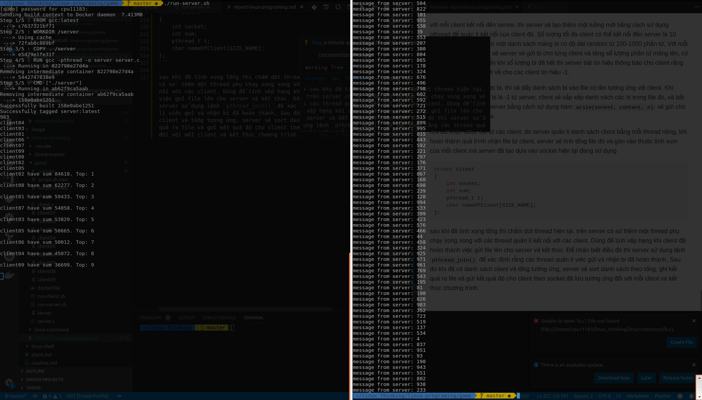
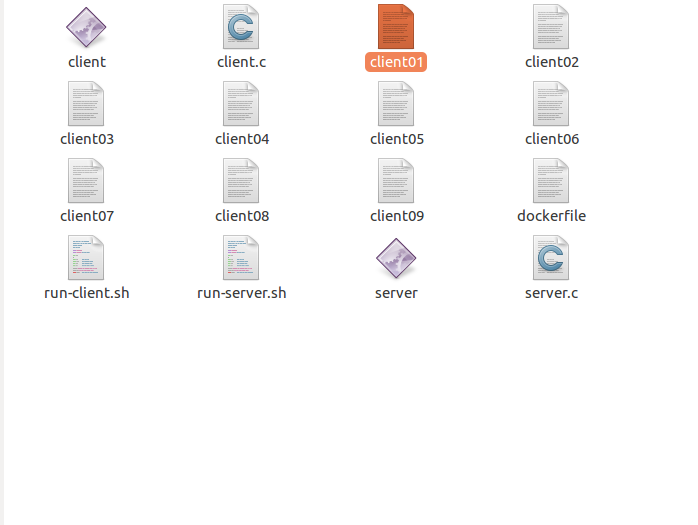
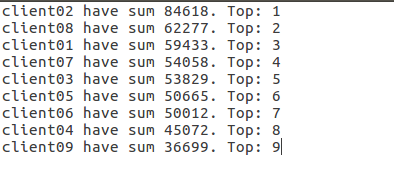

- [Report](#report)
  - [2. Kiến thức về Linux System](#2-ki%E1%BA%BFn-th%E1%BB%A9c-v%E1%BB%81-linux-system)
    - [2.1 File và File System](#21-file-v%C3%A0-file-system)
      - [Hãy nêu rõ triết lý này bằng cách tìm hiểu ngóc nghách của file descriptor trong kernel](#h%C3%A3y-n%C3%AAu-r%C3%B5-tri%E1%BA%BFt-l%C3%BD-n%C3%A0y-b%E1%BA%B1ng-c%C3%A1ch-t%C3%ACm-hi%E1%BB%83u-ng%C3%B3c-ngh%C3%A1ch-c%E1%BB%A7a-file-descriptor-trong-kernel)
      - [Regular file](#regular-file)
      - [Special file](#special-file)
    - [2.4 Process & Thread](#24-process--thread)
      - [2.4.1 Tìm hiểu khái niệm Process trong hệ điều hành](#241-t%C3%ACm-hi%E1%BB%83u-kh%C3%A1i-ni%E1%BB%87m-process-trong-h%E1%BB%87-%C4%91i%E1%BB%81u-h%C3%A0nh)
      - [Các thành phần trong Memory Layout nêu rõ vai trò của từng thành phần, cụ thể: Stack, Heap, Data Segment, Text Segment](#c%C3%A1c-th%C3%A0nh-ph%E1%BA%A7n-trong-memory-layout-n%C3%AAu-r%C3%B5-vai-tr%C3%B2-c%E1%BB%A7a-t%E1%BB%ABng-th%C3%A0nh-ph%E1%BA%A7n-c%E1%BB%A5-th%E1%BB%83-stack-heap-data-segment-text-segment)
        - [Stack](#stack)
        - [Heap](#heap)
        - [Data Segment](#data-segment)
        - [Text Segment](#text-segment)
      - [2.4.2 Thread](#242-thread)
        - [Tìm hiểu khái niệm Thread, POSIX Thread, các API trong POSIX](#t%C3%ACm-hi%E1%BB%83u-kh%C3%A1i-ni%E1%BB%87m-thread-posix-thread-c%C3%A1c-api-trong-posix)
        - [Tìm hiểu về Multi-Threading, các vấn đề gặp phải trong multi-threading](#t%C3%ACm-hi%E1%BB%83u-v%E1%BB%81-multi-threading-c%C3%A1c-v%E1%BA%A5n-%C4%91%E1%BB%81-g%E1%BA%B7p-ph%E1%BA%A3i-trong-multi-threading)
        - [Làm rõ khái niệm race condition, deadlock, cách ngăn chặn race condition, deadlock](#l%C3%A0m-r%C3%B5-kh%C3%A1i-ni%E1%BB%87m-race-condition-deadlock-c%C3%A1ch-ng%C4%83n-ch%E1%BA%B7n-race-condition-deadlock)
    - [2.5 Synchronization](#25-synchronization)
      - [Tìm hiểu khái niệm Semaphore, so sánh Semaphore với Mutex](#t%C3%ACm-hi%E1%BB%83u-kh%C3%A1i-ni%E1%BB%87m-semaphore-so-s%C3%A1nh-semaphore-v%E1%BB%9Bi-mutex)
        - [Semaphore](#semaphore)
        - [So sánh Semaphore với Mutex](#so-s%C3%A1nh-semaphore-v%E1%BB%9Bi-mutex)
      - [Tìm hiểu thêm về Reader Writer Problem](#t%C3%ACm-hi%E1%BB%83u-th%C3%AAm-v%E1%BB%81-reader-writer-problem)
    - [2.6 Networking](#26-networking)
      - [Phân biệt được Nonblocking I/O và Blocking I/O](#ph%C3%A2n-bi%E1%BB%87t-%C4%91%C6%B0%E1%BB%A3c-nonblocking-io-v%C3%A0-blocking-io)
  - [3. Phần thực hành](#3-ph%E1%BA%A7n-th%E1%BB%B1c-h%C3%A0nh)
    - [3.1. Tools](#31-tools)
      - [Biết cách sử dụng GDB on linux](#bi%E1%BA%BFt-c%C3%A1ch-s%E1%BB%AD-d%E1%BB%A5ng-gdb-on-linux)
      - [Tìm hiểu về makefile](#t%C3%ACm-hi%E1%BB%83u-v%E1%BB%81-makefile)
    - [3.2 Linux command](#32-linux-command)
    - [3.3 Trò chơi xếp bi](#33-tr%C3%B2-ch%C6%A1i-x%E1%BA%BFp-bi)
  
# Report

## 2. Kiến thức về Linux System

### 2.1 File và File System

#### Hãy nêu rõ triết lý này bằng cách tìm hiểu ngóc nghách của file descriptor trong kernel

Một cách đơn giản, khi bạn mở hay tạo một file, hệ điều hành sẽ tạo một entry để thể hiện file đó và lưu trữ thông tin về tệp đã mở và dùng nó như một tham số khi read() and write(). Nếu có một trăm file được mở trên hệ điều hành thì sẽ có 100 entry ở một nơi nào đó trong hệ điều hành. Các entry được thể hiện bằng các số nguyên không âm như (100,101,102...). Các số entry này là file descriptor. Một file descripstor có độ dài từ 0 -> Max được xác định bằng câu lệnh ```ulimit -n``` Vì vậy nó chỉ là một số nguyên duy nhất đại diện cho các file được mở trong hệ điều hành. Mối process sẽ có một bảng đặc tả tập tin riêng của nó (file descripstor table), nếu một tiến trình của bạn mở 10 file thì Process table của tiến trình đó sẽ 10 enties cho file descriptor.

Để ứng dụng không thể đọc hay viết trực tiếp vào bảng đặc tả tập tin mà phải thông qua một chỉ số trừu tượng để truy cập tới kernel bằng cách sử dụng system calls và kernel sẽ truy cập đến bảng đăc tả tập tin cho ứng dụng dựa vào chỉ số entry.

#### Regular file

Regular files là một loại file được lưu trữ trong hệ thống file system. Nó được gọi là Regular chủ yếu là để phân biệt với các file đặc biệt khác như directories, symbolic links, sockets... Hầu hết các file được sử dụng bởi user là Regular files. Ví dụ như  executable files, text files và image files. Trong linux kernel, loại file được khai báo ở header của ```sys/stat.h```. Với regular file có kí hiệu tên là S_IFREG và Bitmask là 0100000. với linux sử dụng câu lệnh  "test -f file" nếu trả về 0 là regular file và 1 là loại khác hoặc không tồn tại.

Khi dữ liệu được viết hoặc đọc từ regular file, kernal sẽ thực hiện các hành động theo luật của hệ thống tập tin.

#### Special file

Trong hệ điều hành, một Special files là một loại file được lưu trữ trong hệ thống file system. Special file đôi khi cũng được gọi là device file.

Mục đích của special file là để nhận biết được device dưới dạng tập tin trong hệ thống. Nó cung cấp giao diện chung cho các thiết bị phần cứng hoặc thiết bị ảo được tạo và sử dụng bởi kernel hỗ trợ cho viêc IO. Khi có thao tác viết hoặc đọc dữ liệu từ special file, hoạt động đó sẽ được diễn ra lập tức và không cần tuân theo quy tắc của hệ thống filesystem. Có hai loại: block special files and character special files.  

- Block special files mỗi lần chỉ viết hoặc đọc dữ liệu là theo khối.

- Character special files: mỗi lần chỉ viết hoặc đọc trên 8 bit (1 B)

### 2.4 Process & Thread

#### 2.4.1 Tìm hiểu khái niệm Process trong hệ điều hành

Là một chương trình máy tính đang thực thi. Nhiều tiến trình có thể có nguồn gốc từ một chương trình. Các tiến trình khởi nguồn từ một chương trình có thể thực thi song song, độc lập lẫn nhau hoặc các tiến trình có thể phụ thuộc lẫn nhau và được thực hiện theo một tuần tự nhất đinh. Ngày nay, máy tính cho phép  nhiều tiến trình nạp lên bộ nhớ cùng một lúc nhờ vào cơ chế đa nhiệm ( multitasking).

#### Các thành phần trong Memory Layout nêu rõ vai trò của từng thành phần, cụ thể: Stack, Heap, Data Segment, Text Segment


##### Stack

Chứa các tham số đầu vào của cái hàm, và ghi địa chỉ trả về của hàm vào stack. Và có chức năng ghi nhận cacsgias trị thanh ghi và các thông số trạng thái vào stack đồng thời cấp phát không gian để lưu các biến cục bộ trong hàm.

##### Heap

Là nơi dùng để cấp phát dữ liệu cho các biến được sử dụng trong chương trình, bắt đầu từ phần cuối của Data Segment và mở rộng thêm từ đó xuống vùng nhớ còn trống chung với stack.

##### Data Segment

- Initialized Data Segment:  thường được gọi là Data Segment. là một phần của vùng bộ nhớ ảo của chương trình, nơi chứa các biến toàn cục và các biến static được khởi tạo trong chương trình.  Data segment có thể được chia làm hai khu vực là read-only hoặc read-write.
  
- Uninitialized Data Segment: thường được gọi là “bss” segment, chứa các biến và giá trị khởi tạo không rõ ràng hay được khởi tạo nhưng không có giá trị cụ thể.

##### Text Segment

Đươc biết như đoạn mã code hoặc đơn giản chỉ là văn bản, là một phần của chương trình trong bộ nhớ, chứa các đoạn lệnh hướng dẫn thực thi. Trong vùng nhớ thì text segment thường nằm phía dưới heap hoặc stack để tránh tình trạng heap hoặc stack ghi đè lên text segment khi vùng nhớ của chúng quá nhiều. Thông thường thì text segment chỉ ở chế độ read only để tránh tình trạng bị sửa đổi.

#### 2.4.2 Thread

##### Tìm hiểu khái niệm Thread, POSIX Thread, các API trong POSIX

Thread (tiểu trình): là một tác vụ độc lập nhìn từ CPU, nó bao gồm định danh tiểu trình, một con trỏ lệnh, một tập thanh ghi và stack. Các tiểu trình trong cùng một tiến trình có thể chia sẽ vùng mã nguồn, vùng dữ liệu và những tài nguyên chung khác ví dụ như tập tin đang mở. Một tiến trình có thể có một hoặc nhiều tiểu trình.

POSIX Thread: là một tiêu chuẩn dựa trên các thread API cho c và c++. Nó cho phép sinh ra các quy trình làm viêc mới (thread). Nó hiệu quả nhất trên hệ thống multiprocessor và multi-core nơi mà các dòng quy trình có thể lên kế hoạch để chạy các bộ xử lí khác do đó có thể đạt được tốc độ cao thông qua cơ chế xử lí song song hoặc phân tán. Thread yêu cầu chi phí ít hơn so với fork hoặc là tạo nên một process mới vì hệ điều hành không cần tạo mới virtual memory space và môi trường cho process chạy. Trong khi hiệu quả đạt được hiệu quả cao trên hệ thống nhiều bộ xử lí, thì hiệu quả đó ta cũng có thể thấy trên các hệ thống uniprocessor. Tất cả các Thread trong cùng một process thì đều chia sẻ cùng một không gian địa chỉ. Mục đích cuối cùng của POSIX Thread API là giúp chương trình chạy nhanh hơn.

API POSIX: một số API được sử dụng thường xuyên của Pthread là tạo Thread, kết thúc Thread, đồng bộ thead.

- Tạo Thread  

`pthread_create (thread,attr,start_routine,arg)`

Chức năng của hàm pthread_create tạo mới một thread và thực thi nó. Các tham số đầu vào:

thread: là một biến của thread thuộc kiểu pthread_t duy nhất để phân biệt với các thread khác

attr: một thuộc tính của thead thuộc kiểu pthread_attr_t, đặt là NULL nếu giữ thuộc tính thread mặc định

start_routine: là hàm truyền vào để thread thực thi sau khi được khởi tạo

arg: một tham số được truyền vào start_routine. Phải được truyền bằng dạng tham số với dạng con trỏ void, nếu không cần tham số thì có thể đặt NULL.

- Kết thúc thread: có một số cách như sau để có thể chấm dứt thread đang chạy
  - Hàm xử lí start_routine đã thực thi xong.
  - Sử dụng `pthread_exit()` để thoát khởi thread hiện tại mặc cho nó đã xử lí xong hay chưa, tham số mặc định được truyền hàm pexit() là NUll.

- Thu hồi tài nguyên Thread: Trong Linux, một pthread khi được tạo ra sẽ mặc định là joinable thread. Do đó, thread sau khi kết thúc sẽ được “join” để lấy được trạng thái kết thúc và thu hồi tài nguyên của nó. Hàm join có kiểu như sau `int pthread_join(pthread_t thread, void **retval)`,Hàm pthread_join() sẽ block chương trình và chờ cho thread với ID là “thread” kết thúc, và giá trị return của thread đó được lưu vào biến con trỏ “retval” .

- Đồng bộ thread:
`pthread_mutex_lock()` – giữ  khóa trên biến mutex chỉ định. Nếu mutex đã bị khoá bở một thread khác, lời gọi này sẽ bị giữ lại cho tới khi mutex này mở khoá.
`pthread_mutex_unlock()` – mở khoá biến mutex. Một lỗi trả về nếu mutex đã mở khoá hoặc được sở hữu của một thread khác.

##### Tìm hiểu về Multi-Threading, các vấn đề gặp phải trong multi-threading

Là mô hình cho nhiều tiểu trình chạy song song với nhau giúp giải quyết các bài toán đa nhiệm trong các chương trình hiện đại. MultiThread có bốn tiện ích chính

- Phản hồi: cho phép các chương trình cần sự giao tiếp với người dùng có thể thực thi liên tục, khi phải chờ người dùng nhập dữ liệu thì phần khác của chương trình có thể thực thi.

- Chia sẻ tài nguyên: về nguyên tắc các tiểu trình cùng một tiến trình có thể chia sẻ bộ nhớ và các tài nguyên khác của tiến trình. Vì có thể chia sẻ mã nguồn và dữ liệu làm cho nhiều tiến trình có thể hoạt động trên cùng koojt không gian bộ nhớ.
  
- Kinh tế: việc cấp phát vùng nhớ và tài nguyên cho một tiến trình là rất tốn kém. Bởi vì các tiểu trình có thể chia sẻ cùng một vùng nhớ nên việc tạo tiểu trình mới hoặc chuyển đổi ngữ cảnh giữa các tiểu trình ít tốn kém hơn nhiều. Về cơ bản, tạo mới và quản lí một tiến trình phức tạp và tốn kém hơn so với tiểu trình.

- Tận dụng năng lực máy tính có nhiều bộ xử lí: nheeifu tiến trình có thể thực thi song song trên các bộ xử lí khác nhau. Còn tiến trình thì chỉ có thể thực thi trên một bộ xử lí cho dù máy tính có nhiều bộ xử lí.

**Vấn đề thường gặp của multiThread**: vấn đề thường gặp là việc chuyển đổi ngữ cảnh (context switch). Chuyển đổi ngữ cảnh là một quá trình lưu lại trạng thái hiện hành và chuyển sang trạng thái khác của CPU sao cho nhiều tến trình có thể chia sẻ cùng một CPU duy nhất. Mỗi tác vụ chuyển đổi ngữ cảnh mất rất nhiều thời gian xử lí và là tác vụ tốn kém nhất của hệ điều hành. Vì vậy cần phải thiết kế hệ thống đa tiểu trình như thế nào để có thể hạn chế tối đa những chuyển đổi ngữ cảnh. Bên cạnh đó còn có vấn đề về deadock và race condition sẽ được làm rõ ở phần tiếp theo.

##### Làm rõ khái niệm race condition, deadlock, cách ngăn chặn race condition, deadlock

**Race condition**: Trong hệ điều hành thường có những vùng nhớ chia sẻ dùng chung hoặc của không gian lưu trữ chung. Các tiến trình đồng thời truy cập và sửa đổi các giá trị trên vùng nhớ này làm cho dữ liệu trên vùng nhớ này mất đi tính đúng đắn được gọi là race conditon.

Deadlock: là hiện tượng tranh chấp tài nguyên giữa hay nhiều câu lệnh trong đó lệnh này giữa tài nguyên mà lệnh kia cần dẫn tiến việc không lệnh nào có thể kết thúc để giải phóng tài nguyên làm đứng chương trình.

**Cách ngăn chặn race condition và deadlock**:  Đầu tiên ta cần phải biết về khái niệm gọi là miền giăng: miền giăng là đoạn mã nguồn liên quan đến việc truy cập vùng nhớ dùng chung. Để ngăn chặn thì bài toán của ta cần phải thỏa mãn các điều kiện sau

- Tại một thời điểm chỉ duy nhất một tiến trình vào miền giăng.

- Không được giả sử về tốc độ xử lí của CPU hay số lượng CPU.
  
- Không có tiến trình nào đang ở ngoài miền giăng mà có thể khóa không cho tiến trình khác vào miền giăng.
  
- Không có tiến trình nào chờ đợi mãi mãi để được vào miền giăng.

### 2.5 Synchronization

#### Tìm hiểu khái niệm Semaphore, so sánh Semaphore với Mutex

##### Semaphore

Là một cấu trúc dữ liệu để đảm bảo rằng nhiều quy trình không truy cập vào tài nguyên dùng chung trong các môi trường làm việc song song, dùng để tránh xảy ra hiện tượng deadlock và race condition. Có hai thao tác tính là down(s) và up(s). Mỗi semaphore được liên kết với một hàng đợi nhất định dùng để mở và khóa các tiến trình để vào miền giăng.

##### So sánh Semaphore với Mutex

Tương tự như semaphore nhưng sự khác biệt ở đây là mutex chỉ cho phép một luồng duy nhất sử dụng tài nguyên, trong khi đó semaphore cho phép một số lượng truy cập nhất định đã được quy định trước vào một tài nguyên. Khi các luồng khác muốn truy cập thì phải đợi cho đến khi luồng khác đã kết thúc việc sử dụng tài nguyên đó.

#### Tìm hiểu thêm về Reader Writer Problem

Xem xét tình huống nơi mà ta có một file được chia sẻ với nhiều người

- nếu có một người cố gắng thay đổi nội dung thì những người khác không được đọc hoặc viết ngay tại thời điểm đó đến khi người đó hoàn thành xong công viêc. Không thì việc thay đổi sẽ không được hiển thị.

- Tuy nhiên nếu có người đọc file thì những người khác cũng có thể đọc cùng một lúc tại thời điểm đó

Tình huống vừa được liệt kê được gọi là Reader Writer Problem.

Có một số vấn đề cụ thể như sau

- Một tập dữ liệu được chia sẻ cho nhiều tiến trình hoặc chương trình

- Khi lệnh viết đã sẵn sàng thì chỉ có thể viết ngay tại thời điểm đó không được đọc hoặc viết ở nơi khác.

- Nếu còn tiến trình đang đọc thì không được viết vào

- Người đọc chỉ có thể đọc mà không được viết

### 2.6 Networking

#### Phân biệt được Nonblocking I/O và Blocking I/O

- **Nonblocking I/O**: hoạt động I/O được thực hiện một cách độc lập với các hoạt động khác của hệ thống. Hệ thống của bạn sẽ không cần vào trạng thái chờ, thay vào đó có thể thực hiện các hoạt động khác độc lập với yêu cầu I/O. Phản hồi từ I/O sẽ được bổ sung lại cho hệ thống khi hoạt động kết thúc nhưng lúc này hệ thống sẽ không bị đình truệ ở thời điểm đó. mỗi khi có request gửi từ IO device thì nó sẽ được đưa vào hàng đợi và phản hồi cũng sẽ được trả về lần lượt sau đó. Để thực hiện được điều này ta cần sự hỗ trợ của lập trình song song, tạo nhiều luồng cho mỗi hoạt động I/O.

- **Blocking I/O:** từ cái tên ta đã biết hằng có thứ gì đó sẽ bị khóa để chờ hoạt động I/O. Hoạt động I/O được hoàn thành ở phần cứng ở mức cơ sở, blocking ở đây có nghĩa là các hoạt động của hệ thống của bạn phải ở trạng thái đợi cho đến khi hoạt động I/O được hoàn thành. Nói cách khác là hệ thống không thể làm bất cứ thứ gì trừ khi có các hoạt động đã được yêu cầu đang thực thi. Đây là công nghệ được sử dụng cho tất cả các thiết bị đồng bộ hoặc hệ thống real-time. Điều này có hạn chế là hệ thống phải trong trạng thái đợi đến khi việc I/O được hoàn thành nhưng nó đảm bảo tính an toàn và dữ liệu không bị cũ hoặc dữ liệu được nhất quán với nhau.

## 3. Phần thực hành

### 3.1. Tools

#### Biết cách sử dụng GDB on linux

GDB là công cụ debug được triển khai trên linux thường được sử dụng để debug cho chương trình c và c++. Cho phép người dùng có thể kiểm soát các chương trình và kiểm tra các biến khi có vấn đề xảy ra.

GDB cho phép bạn chạy chương trình đến một điểm, dừng tại đó và có thể in râ các biến giá trị ngay đó hoặc có thể nhảy vào trong các hàm,chạy mỗi dòng và in ra các giá trị sau khi thực hiện mỗi dòng đó.

Một số thao tác debug thường được sử dụng khi dùng GDB

- ```gdb [tên chương trình]``` để có thể bắt đầu debug với chương trình đó

- ```run``` để chạy chương trình hiện tại

- ```list [dòng code]``` để in ra các dòng code trong chương trình

- ```next``` chạy chương trình tới dòng tiếp theo và dừng tại đó, nếu dòng đó là hà, thì nó sẽ thực hiện toàn bộ hàm đó và dùng.

- ```step``` tương tự như lệnh next nhưng điểm khác nhau là nếu ở dòng hiện tại của bạn là một hàm nó sẽ nhảy vào cái hàm đó và thực hiện dòng đầu tiên của hàm và dừng.

- ```finish``` dùng để chạy hết khi đang trong một hàm.

- ```break [dòng hoặc tên hàm]``` dùng để đặt breakpoint tại hàm đó, chương trình sẽ chạy đến khi đến điểm breakpoint

- ```continue``` để tiếp tục thực hiện chương trình nếu đến điểm breakpoint
- ```delete [vi trí breakpoint]``` để xóa điểm breakpoint trong chương trình debug

- ```info b``` để liệt kê ra các breakpoint hiện tại

- ```print x``` để in ra giá trị biến x thời điểm hiện tại

- ```set x=3``` để đặt giá trị của biến x là 3

#### Tìm hiểu về makefile

Vấn đề: Khi biên dịch một chương trình đơn giản chỉ có một vài file thì lúc này chưa xảy ra vấn đề gì, nhưng khi số lượng file cần biên dịch tăng lên, chương trình phức tạp, nhiều modul hơn và nhiều người tham gia thì sẽ có các vấn đề phát sinh như

- Khó quản lí một file lớn

- Mỗi lần thay ddoooir tcaafn thời gian biên dịch lâu

- Nhiều người lập trình không thể thay doodoir cùng một file đồng thời

- Chương trình được phân ra thành nhiều module

Makefile là một file dạng script chứa các thông tin

- Cấu trúc project gồm các file liên quan và các file phụ thuộc ví dụ như là file .h và .c

- Các câu lệnh để  tạo ra file

Lệnh make sẽ đọc nội dung của Makefile, hiểu kiến trúc của project và thực thi các câu lệnh bên trong nó

Một cấu trúc make file cơ bản sẽ có dạng như sau: 


- Rule: các rule cần thực hiện khi compile

- Dependency:  là các file cần thiết để tạo ra target

- Action: là câu lệnh compile để tạo ra target từ Denpendency. Action được thụt lùi vào 1 Tab so với Target

- Target: là file được hình thành sau khi quá trình make được thực hiện

Để hiểu rõ thêm thì xem ví dụ cụ thể sau: Giả sử ta có một chương trình chứa các file

- Chương trình chứa 3 file: main.c, sum.c, sum.h

- File sum.h được dùng bởi cả 2 file main.c và sum.c

- File Thực thi là sum

```sh
sum: main.o sum.o  
   gcc -o sum main.o sum.o  
 main.o: main.c sum.h  
   gcc -c main.c  
 sum.o: sum.c sum.h  
   gcc -c sum.c

```

Vậy thứ tự thực hiền lần lượt của file make là: khi bạn thực hiện lệnh make, chương trình make sẽ nhảy đến target đầu tiên là sum với mục đích để tạo ra nó, để làm được điều đó make đi kiểm tra lần lượt (từ trái qua phải: main.o -> sum.o) xem các dependency của sum đã tồn tại chưa. Denpendency đầu tiên là main.o chưa có, cần phải tìm rule nào đó mà ở đó main.o đóng vai trò là target, make tìm ra rule thứ 2 và nó nhảy đến thực hiện rule thứ 2 đề tạo ra main.o (lưu ý khi nó chạy rule 2 thì cũng giống y như khi chạy rule đầu tiên, có thể coi như là đệ quy). Sau khi tạo ra main.o, make trở về rule 1 để tiến hành kiểm tra tiếp xem dependency thứ hai là sum.o đã tồn tại chưa, sum.o chưa có vì thế make tiến hành các bước tương tự như đối với main.o. Sau khi tất cả các dependency được tạo ra, make mới có thể tạo ra file chạy cuối cùng là sum.

Nguyên tắc thực hiện theo thứ tự sau

- Tìm và Tạo ra các file object cần thiết cho file thực thi cuối cùng

- Tạo ra chương trình nhị phân cuối cùng từ các file object đã được tạo ra trước đó.

### 3.2 Linux command

Viết chương trình C mô phỏng lại lệnh ls -l

Chương trình chi tiết mô phỏng lại lệnh ls -l được mô phỏng lại bằng file ls.c lưu trong folder  linux-command.

Sử dụng thư viện stat ,DIR và dirent để thực thi, đầu tiên dùng dirent để lấy danh sách các file và folder hiện tại trên đường dẫn đã được truyền vào. Với từng file và folder đã có ta sử dụng thư viện stat và DIR  để có thể lấy thông tin chi tiết của từng file hoặc folder đã có như quyền đọc ghi, UID, GID, size... Thực thi cho đến khi liệt kê hết file và folder ở đường dẫn được truyền vào.

### 3.3 Trò chơi xếp bi

sử dụng thư viện socket trong c để client kết nối với server với cấu trúc như sau


Các hàm chính được sử dụng

- Tạo socket với hàm socket (int family, int type, int protocol) các tham số trong đó theo thứ tự là họ giao thức, kiểu socket, kiểu giao thức.

- Gán địa chỉ cho socket bind (int sockfd, const struct sockaddr *sockaddr, socklen_t addrlen) các tham số lần lượt là mô tả socket vừa tạo, con trỏ chỏ đến địa chỉ socket, độ lớn địa chỉ
  
- Chỉ định socket lắng nghe kết nối listen (int sockfd, int backlog) trong đó sockfd là mô tả socket vừa tạo, backlog là số lượng tối đa các kết nối đang chờ

- Chờ/chấp nhận kết nối accept (int sockfd, struct sockaddr *cliaddr, socklen_t *addrlen) lần lượt có các tham số là mô tả socket vừa tạo, con trỏ tới cấu trúc địa chỉ socket của tiến trình kết nối đến, độ lớn cấu trúc địa chỉ
  
- Thiết lập kết nối với máy chủ TCP connect (int sockfd, const struct sockaddr *servaddr, socklen_t addrlen)

với mỗi client kết nối đến server, thì server sẽ tạo thêm một luồng mới bằng cách sử dụng pthread để quản lí kết nối của client đó. Số lượng tối đa client có thể kết nối đến server là 10 client. Trên server sẽ có một danh sách mảng bi có độ dài random từ 100-1000 phần tử, Với mỗi client kết nối thì server sẽ server sẽ gửi bi cho từng client và tăng số lượng phần tử mảng lên, cứ tiếp tục như vậy cho đến khi số lượng bi đã hết thì server bật tín hiệu thông báo cho client rằng đã hết bi bằng cách gửi về cho các client tín hiệu -1.

Mỗi client khi nhận được bi, thì sẽ đẩy danh sách bi vào file có tên tương ứng với client. Khi nhận được tín hiệu hết bi là -1 từ server, client sẽ sắp xếp danh sách các bi trong file đó, và bắt đầu gửi lại file đó cho server bằng cách sử dụng hàm `        write(socket, content, n)` sẽ gửi cho đến khi hết nội dung file. 

Khi đã nhận được file từ các client, do server quản lí danh sách client bằng mỗi thread riêng, khi hoàn thành quá trình nhận file từ client, server sẽ tính tổng file đó và gán vào thuộc tính sum của mỗi client mà server đã tạo dựa vào socket hiện tại đang sử dụng

```c
struct client
{
    int socket;
    int sum;
    pthread_t t;
    char nameOfClient[SIZE_NAME];
};
```

sau khi đã tính xong tổng thì chấm dứt thread hiện tại. trên server có sử  thêm một thread phụ chạy xong xong với các thread quản lí kết nối với các client. Dùng để tính xếp hạng khi client đã hoàn thành việc gửi file lên cho server và kết thúc. Để nhận biết điều đó thì server sử dụng lệnh `pthread_join()` để xác định rằng các thread quản lí viêc gửi và nhận bi đã hoàn thành. Sau đó khi đã có danh sách client và tổng tương ứng, server sẽ sort danh sách theo tổng, ghi kết quả ra file và gửi kết quả đó cho client theo socket đã lưu tương ứng đối với mỗi client và kết thúc chương trình.

Đây là kết quả chạy chương trình server trên docker và kết quả



Đây là danh sách kết quả mà server gửi về cho client




Đây là kết quả của mỗi file


