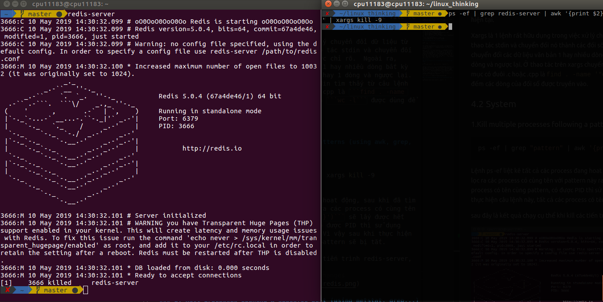
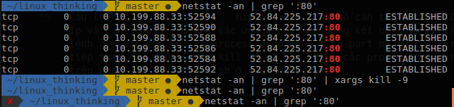

- [3.Bài tập](#3b%C3%A0i-t%E1%BA%ADp)
  - [3.1 Processing Text](#31-processing-text)
    - [1.Count the number of lines satisfying a specific pattern in a log file](#1count-the-number-of-lines-satisfying-a-specific-pattern-in-a-log-file)
    - [2.Calculate KLOC of code C/C++ files in a directory](#2calculate-kloc-of-code-cc-files-in-a-directory)
  - [3.2 System](#32-system)
    - [1. Kill multiple processes following a patterns (using awk, grep, xargs)](#1-kill-multiple-processes-following-a-patterns-using-awk-grep-xargs)
    - [2. Kill processes opening a specific port (using netstat, grep...)](#2-kill-processes-opening-a-specific-port-using-netstat-grep)
    - [3.List opennned ports, handles](#3list-opennned-ports-handles)
    - [4.Find files via regular expressions, and remove them](#4find-files-via-regular-expressions-and-remove-them)
    - [5. List, one at a time, all files larger than 100K in the /home/username directory tree. Give the user the option to delete or compress the file, then proceed to show the next one. Write to a logfile the names of all deleted files and the deletion times](#5-list-one-at-a-time-all-files-larger-than-100k-in-the-homeusername-directory-tree-give-the-user-the-option-to-delete-or-compress-the-file-then-proceed-to-show-the-next-one-write-to-a-logfile-the-names-of-all-deleted-files-and-the-deletion-times)
# 3.Bài tập

## 3.1 Processing Text

### 1.Count the number of lines satisfying a specific pattern in a log file

sử dụng câu lệnh sau ở đường dẫn hiện tại để có thể in ra số lượng dòng thỏa mãn pattern trong file có tên là filename.

```sh
grep -c "pattern" filename
```

câu lệnh trên có mẫu sử dụng grep có chức năng chính là tìm kiếm các dòng trùng khớp với pattern trong một file cố định, trong nhiều file hoặc theo regular expression, các file ở thư mục con. với cái options như sau

```sh
grep [options] pattern [files]
```

có một số options được sử dụng nhiều như
-c : Chỉ in số  lượng dòng có chứa mẫu đó
-h : hiện các dòng trùng khớp nhưng không hiển thị tên tệp
-i : bôi đỏ những mẫu trùng khớp trong file
-l : hiển thị danh sách tên tệp có chứa mẫu
-n : hiển thị danh sách dòng trong tệp thỏa kèm theo số lượng dòng kế bên
-v : in ra tất cả các dòng
-f file : Takes patterns from file, one per line.
-o : ở mỗi dòng tìm thấy chỉ in ra mẫu trùng khớp

### 2.Calculate KLOC of code C/C++ files in a directory

```sh
sudo find . -regextype posix-egrep -regex    | xargs wc -l
```

Lệnh find được dùng để find các file và thư mục và có thể thực hiện các hoạt động tiếp theo trên chúng sau khi đã tìm thấy. Nó hỗ trợ cho viêc tìm file, folder, tên,.. Ở đây được dùng để  tìm tên các file .c và .cpp ở đường dẫn hiện tại bằng biểu thức regular express tion

Giải thích câu lệnh gerular expression: từ đường dẫn hiện tại, tìm các file và folder thỏa điều kiện có đuôi là .c và .cpp

Xargs là 1 lệnh rất hữu dụng trong việc xử lý chuyển đổi dữ liệu từ stdin sang đối số dòng lệnh.  Nó có thể thao tác stdin và chuyển đối nó thành các đối số dòng lệnh cho 1 lệnh được chỉ rõ.  Ngoài ra, xargs có thể chuyển đổi các dữ liệu văn bản 1 hay nhiều dòng bất kỳ thành các định dạng khác, như là nhiều dòng hay 1 dòng và ngược lại. Ở thao tác trên xargs chuyển các dữ liệu stdin tìm thấy từ câu lệnh phía trước tìm các thư mục có đuôi .c hoặc .cpp là ```sudo find . -regextype posix-egrep -regex '.*/.*\.(c|cpp)$'``` để làm đối số dòng lệnh cho câu lệnh ```wc -l``` được dùng để đếm các dòng của đối số được truyền vào.

## 3.2 System

### 1. Kill multiple processes following a patterns (using awk, grep, xargs)

```sh
ps -ef | grep "pattern" | awk '{print $2}' | xargs kill -9
```

Lệnh ps -ef liệt kê tất cả các process đang hoat động, sau khi đã tìm được dựa vào đó lệnh grep "pattern" sẽ lọc ra các process có cùng tên với pattern này ra và lệnh ```awk '{print $2}')``` sẽ lấy được hết PID của từng process có tên cùng pattern, có được PID thì sử dụng lệnh ```kill -9```để tắt những process đó. Vì vậy sau khi thực hiện câu lệnh này, tất cả các process có tên là pattern sẽ bị tắt.

sau đây là kết quả chạy cụ thể khi kill các tiến trình redis-server, sau khi chạy thì redis-server đã bị tắt



### 2. Kill processes opening a specific port (using netstat, grep...)

```sh
netstat -ltnp | grep :[port] | awk '{print $7}' | awk 'BEGIN {FS="/";} {print $1}' | xargs kill
```

Câu lệnh ```netstat -ltnp``` Lệnh netstat trên linux là một lệnh nằm trong số các tập lệnh để giám sát hệ thống trên linux. netstat giám sát cả chiều in và chiều out kết nối vào server, hoặc các tuyến đường route, trạng thái của card mạng. lệnh netstat rất hữu dụng trong việc giải quyết các vấn đề về sự cố liên quan đến network như là lượng connect kết nối, traffic, tốc độ, trạng thái của từng port, Ip …


* -l chỉ ra các process đang lắng nghe trên các socket
* -t chỉ ra các process sử dụng giao thức tcp
* -n hiển thị địa chỉ ip đang sử dụng thay vì tên của nó
* -p hiển thị chỉ số PID của process đang chạy

Tiếp theo grep ```:[port]``` lọc ra các process đang chạy trên các port mà ta cần. ```awk '{print $7}'``` sau câu lệnh này ta sẽ thu được kết quả như sau PID/code.

Để lấy được PID thì ta sử dụng FS trên awk để phân loại ra, FS trên awk mặc định là sử dụng khoảng trắng để phân biệt ở các dòng, ta cần cài đặt để  nó phân tích bằng kí tự /. Ta sử dụng ```awk 'BEGIN {FS="/";} '{print $1}'```.

Từ đó câu lệnh grep có thể lọc ra process đang chạy trên port mà ta chỉ định. tiếp theo câu lệnh ```xargs kill -9``` có thể  dừng các process đang chạy trên port mà ta đã chỉ định ở câu lệnh grep.



### 3.List opennned ports, handles

Tương tự như đề bài trên ta dùng câu lệnh netstat để  liệt kê danh sách các process đang mở trên các port

```sh
netstat -ltunp
```

### 4.Find files via regular expressions, and remove them

```sh
ls | grep -P "expression" | xargs -d"\n" rm
```

* ls liêt kê danh sách file
* grep -P "regular expressions" liệt kê các file và folder trùng khớp với biểu thức
* xargs xóa những file đã tìm được phía trước với mỗi dòng tìm được

ví dụ sau đây xóa một file có đuôi .py có chữ bắt đầu là my

```sh
ls | grep -P "^my.*[py]$" | xargs -d"\n" rm
```

### 5. List, one at a time, all files larger than 100K in the /home/username directory tree. Give the user the option to delete or compress the file, then proceed to show the next one. Write to a logfile the names of all deleted files and the deletion times

bài làm được lưu trong file list-and-delete-file.sh trong cùng đường dẫn. Trong đó sử dụng câu lệnh `sudo find /home/cpu11183 -type f -size +100k` để liệt kê danh sách file có độ lớn hơn 100k, với mỗi file có thể tùy chọn xóa hoặc nén bằng cách nhập "D" hoặc "E" để có thể xóa hoặc nén tương ứng với mỗi file được liệt kê ra màn hình command.