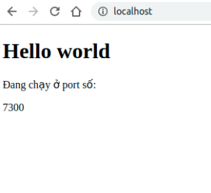
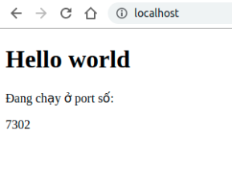
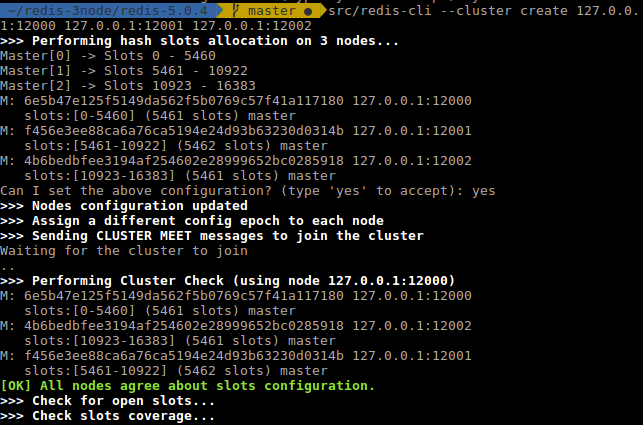

- [4. nội dung báo cáo](#4-n%E1%BB%99i-dung-b%C3%A1o-c%C3%A1o)
  - [Định lí CAP](#%C4%91%E1%BB%8Bnh-l%C3%AD-cap)
    - [CA Consistency and availability](#ca-consistency-and-availability)
    - [AP Availability and partition tolerance](#ap-availability-and-partition-tolerance)
    - [CP - Consistency and partition tolerance](#cp---consistency-and-partition-tolerance)
  - [Khái niệm eventual consistency](#kh%C3%A1i-ni%E1%BB%87m-eventual-consistency)
  - [Khái niệm throughput, latency](#kh%C3%A1i-ni%E1%BB%87m-throughput-latency)
  - [Các phương pháp để scale database (MySQL)](#c%C3%A1c-ph%C6%B0%C6%A1ng-ph%C3%A1p-%C4%91%E1%BB%83-scale-database-mysql)
    - [Master-slave replication](#master-slave-replication)
    - [Master - master replication](#master---master-replication)
    - [Federation](#federation)
    - [Sharding](#sharding)
    - [Denormalizaiton](#denormalizaiton)
    - [SQL tunning](#sql-tunning)
      - [Giới thiệu](#gi%E1%BB%9Bi-thi%E1%BB%87u)
      - [Mục tiêu điều chỉnh](#m%E1%BB%A5c-ti%C3%AAu-%C4%91i%E1%BB%81u-ch%E1%BB%89nh)
      - [Tighten up the schema](#tighten-up-the-schema)
      - [Use good indices](#use-good-indices)
  - [Task Queue khác gì Message Queue](#task-queue-kh%C3%A1c-g%C3%AC-message-queue)
- [5 Bài Tập](#5-b%C3%A0i-t%E1%BA%ADp)
  - [5.1 Load Balancer](#51-load-balancer)
    - [1. Khái niệm](#1-kh%C3%A1i-ni%E1%BB%87m)
    - [2. Kiến trúc bên trong nginx. Làm rõ việc tại sao nginx dùng single thread](#2-ki%E1%BA%BFn-tr%C3%BAc-b%C3%AAn-trong-nginx-l%C3%A0m-r%C3%B5-vi%E1%BB%87c-t%E1%BA%A1i-sao-nginx-d%C3%B9ng-single-thread)
    - [3. Thí Nghiệm](#3-th%C3%AD-nghi%E1%BB%87m)
  - [5.2 Caching](#52-caching)
    - [1.Lý thuyết](#1l%C3%BD-thuy%E1%BA%BFt)
      - [LRU](#lru)
      - [LFU](#lfu)
    - [2. Thực hành](#2-th%E1%BB%B1c-h%C3%A0nh)
  - [5.3 Redis](#53-redis)
    - [1.Khái niệm cơ bản về Redis và kiến trúc](#1kh%C3%A1i-ni%E1%BB%87m-c%C6%A1-b%E1%BA%A3n-v%E1%BB%81-redis-v%C3%A0-ki%E1%BA%BFn-tr%C3%BAc)
      - [Redis single instance Architecture](#redis-single-instance-architecture)
      - [Redis persistence](#redis-persistence)
      - [Redis Replication](#redis-replication)
      - [Persistance in Redis Replicaiton](#persistance-in-redis-replicaiton)
      - [Clustering In Redis](#clustering-in-redis)
      - [Persistance In Cluster](#persistance-in-cluster)
      - [Cluster And Replication Together](#cluster-and-replication-together)
    - [2.Cấu trúc dữ liệu của Redis, tại sao lại dùng hyperloglgo](#2c%E1%BA%A5u-tr%C3%BAc-d%E1%BB%AF-li%E1%BB%87u-c%E1%BB%A7a-redis-t%E1%BA%A1i-sao-l%E1%BA%A1i-d%C3%B9ng-hyperloglgo)
      - [String](#string)
      - [Hash](#hash)
      - [List](#list)
      - [Sets](#sets)
      - [Sorted Set](#sorted-set)
      - [Cấu trúc dữ liệu HyperLogLogs](#c%E1%BA%A5u-tr%C3%BAc-d%E1%BB%AF-li%E1%BB%87u-hyperloglogs)
    - [3. Luật đặt tên cho key phù hợp](#3-lu%E1%BA%ADt-%C4%91%E1%BA%B7t-t%C3%AAn-cho-key-ph%C3%B9-h%E1%BB%A3p)
    - [4.Config cluster redis 3 node, chạy cùng machine, khác port](#4config-cluster-redis-3-node-ch%E1%BA%A1y-c%C3%B9ng-machine-kh%C3%A1c-port)
    - [5.Viết chương trình chat đơn giản sử dụng Redis pub/sub](#5vi%E1%BA%BFt-ch%C6%B0%C6%A1ng-tr%C3%ACnh-chat-%C4%91%C6%A1n-gi%E1%BA%A3n-s%E1%BB%AD-d%E1%BB%A5ng-redis-pubsub)
      - [Hướng dẫn sử dụng](#h%C6%B0%E1%BB%9Bng-d%E1%BA%ABn-s%E1%BB%AD-d%E1%BB%A5ng)
      - [Chi tiết cài đặt](#chi-ti%E1%BA%BFt-c%C3%A0i-%C4%91%E1%BA%B7t)
- [6. Tài liệu tham khảo](#6-t%C3%A0i-li%E1%BB%87u-tham-kh%E1%BA%A3o)
# 4. nội dung báo cáo

## Định lí CAP

Trong hệ thống máy tính phân tán, bạn có thể hỗ trợ, đánh đổi lẫn nhau cho việc đảm bảo hai trong ba việc sau đây:

- Consistency: dữ liệu giống nhau trên các cluster, do đó bạn có thể đọc hoặc viết từ bất kì node nào và có thể lấy cùng một bộ dữ liệu.
- Availability: mỗi yêu cầu đều được nhận phản hồi nhưng không đảm bảo rằng nó sẽ chứa những nội dung có phiên bản gần nhất. Có khả năng truy cập vào các cluster kể cả nếu một node trong cluster ấy bị lỗi.

- Partition tolerance: hệ thống vãn tiếp tục hoạt động dù cho có bị phân vùng đặc quyền do lỗi mạng khiến các node trong cluster không thể giao tiếp được với nhau.
  
Mạng không đáng tin cậy, do đó bận cần phải hỗ trợ partition toleranc. Do đó bạn cần phải đánh đổi giữa tính nhất quán và tính khả dụng của phần mềm của bạn. VÍ dụ trong trường hợp bạn cần có availability và partition toleranc, bạn cần phải từ bỏ consistency. giả sử rằng bạn có hai node X và Y, hiện tại thì X và Y  không thể giao tiếp kết nối được với nhau, vì vậy bạn không thể đồng bộ hóa việc cập nhật.


### CA Consistency and availability

Dữ liệu là nhất quán giữa tất cả các node, miễn là tất cả các node đều được online và bạn có thể đọc và viết từ bất kì node vào và đảm bảo rằng dữ liệu là như nhau.

### AP Availability and partition tolerance

Các node vẫn tiếp tục hoạt động kể cả khi chúng không thể giao tiếp được với nhau và sẽ đồng bộ dữ liệu nếu vấn đề được giải quyết. nhưng không đảm bảo rằng tất cả các node sẽ có dùng data. đây là một lựa chọn tốt nếu các công ty có nhu cầu cần thiết cho eventual consistency hoặc khi hệ thống vẫn cần hoạt động dù cho bị lỗi phía bên ngoài.

### CP - Consistency and partition tolerance

Dữ liệu được nhất quán giữa các node, và trở nên không khả dụng khi có node bị lỗi. CP là lựa chọn tốt nếu công ty của bạn cần yêu cầu  atomic reads and writes.

## Khái niệm eventual consistency

Là một phương pháp được sử dụng trong hệ thống với nhiều thao tác copy trong cùng một data. Khi sử dụng nhiều bản sao cho một CSDL, giả sử có một write request đến (insert, update, delete dữ liệu) thì chúng ta phải làm sao cho các bản sao còn lại cũng nhận được request tương ứng để đồng bộ dữ liệu.
Việc đồng bộ dữ liệu này sẽ tốn thời gian (có thể rất nhỏ), nhưng trong khoảng thời gian đó, nếu có một read request đến một bản sao dữ liệu chưa đồng bộ xong thì request đó sẽ nhận được kết quả cũ hơn (stale data).
eventual consistency có độ trễ yêu cầu thấp, kết quả trả về nhanh nhưng dữ liệu nhận được có thể không phải là dữ liệu mới nhất.

## Khái niệm throughput, latency

- Latency: thời gian cần thiết cho gói tin được truyền qua mạng hay còn được hiểu là độ trễ trung bình của các chuyến đi trong th ời gian đã thực hiện. Có thể hình dung Letency là thời gian để đi qua ống nước.

- Throughtput: lượng dữ liệu được gửi và nhận trong một đơn vị thời gian.có thể  hình dung throughput là lượng nước chảy trong một đơn vị thời gian.

## Các phương pháp để scale database (MySQL)

Có rất nhiều công nghệ để scale dữ liệu quan hệ như master-slave replication, master-master replication, federation, sharding, denormalization, and SQL tuning.

### Master-slave replication


Quá trình cho phép bạn dễ dàng duy trì nhiều bản sao của dữ liệu bằng cách cho nó sao chép tự động từu một nhánh master tạo ra một cơ sơ dữ liệu slave. Giúp cho việc tạo sao lưu cho dữ liệu, một cách phân tích dữ liệu mà không sử dụng các cơ sở dữ liệu chính. Tùy vào cấu hình, bạn có thể sao chép tất cả các cơ sở dữ liệu, hoặc một phần thậm chí là một bảng được lựa chọn trong cơ sở dữ liệu.

Server master lưu trữ phiên bản cơ sở dữ liệu phục vụ ứng dụng, server slave lưu trữ phiên bản cơ sở dữ liệu nhân bản, quá trình nhân bản từ master sang slave được gọi là replication.

Tất cả các thay đổi trên master sẽ được ghi lại dưới dạng file log binary, sau đó slave đọc theo file log này, thực hiện tao tác như trong file log, từ đó server slave sẽ được cập nhật như master, việc đọc file log này được thực hiện rất nhanh.

Ưu điểm

- Giảm tải cho server master: các thao tác đọc từ client được chuyển cho server slave từ đó có thể giảm  tải cho server master
- có thể sao lưu dữ liệu mà không ảnh hưởng gì đến máy chủ
- Slave có thể ở chế độ offine và đồng bộ với master không cần down.
  
### Master - master replication


Cả hai master đều phục vụ cho việc đọc và viết và tự đồng bộ hóa với nhau trên việc viết vào dữ liệu. nếu một trong số các master bị down, thì hệ thống có thể tiếp tục hoạt động với các thao tác viết và đọc, được dùng cho các hệ thống có cấu hình dùng cho việc đáp ứng cao.

Ưu điểm:

- Ứng dụng có thể đọc từ các master
- Việc ghi có thể được phân phối trên cả hai master
- Chuyển đổi dự phòng đơn giản, tự động và nhanh chóng

Khuyết điểm:

- Cấu hình và triển khai không đơn giản như  master - slave
- Bạn cần phải cân load balancer hoặc thay đổi logic của ứng dụng để có thể xác định được nơi nào để ghi
- Hầu hết hệ thống master-master vi phạm cơ chế ACID hoặc tăng độ trễ vì sự đồng bộ hóa dữ liệu giữa các master
- Vấn đề xung đột sẽ xuất hiện nhiều hơn nếu thêm nhiều node vào và khi độ trễ tăng lên.

Khuyết điểm của cả relicaiton:

- khi  server master bị fail thì hệ thống có thể bị down và mất data
- khi ứng dụng có quá nhiều thao tác viết, thao tác đọc có thể bị trì truệ vì phải cập nhật liên tục.
- Ở một số hệ thống, viết vào master có thể được hiện với cơ chế multithread trong khi đó thì thao tác đọc chỉ được hỗ trợ chạy tuần tự với cơ chế single thread.

### Federation


Federation chia nhỏ cơ sở dữ liệu theo chức năng. Ví dụ thay vì một cơ sở dữ liệu đơn, bạn có thể chia nó thành ba phần nhỏ: forums, users and products, điều này giúp ta hạn chế cơ chế đọc và viết trong cùng một database và do đó độ trễ của toàn bộ hệ thống sẽ ít hơn rất nhiều.

Ưu điểm

- Cơ sở dữ liệu nhỏ hơn có thể phù hợp với các bộ nhớ, nó sẽ dẫn đến việc nhiều cache hit hơn do bộ nhớ cache được cải thiện.
- Với việc chia nhỏ databse ra thành nhiều phần nhỏ hơn, bạn có thể thực hiện việc ghi song song với nhau, tăng thông lượng.

Khuyết điểm:

- Không hiệu quả khi mô hình hệ thống của bạn yêu cầu một lượng lớn chức năng và bảng
- Cần phải cập nhật logic ứng dụng để xác định cơ sở dữ liệu nào thực hiện tao tác đọc và ghi
- Join dữ liệu từ hai cơ sở dữ liệu khác nhau phức tạp hơn rất nhiều
- Yêu cầu nhiều hơn về phần cứng và phức tạp hơn.

### Sharding


Sharding phân phối dữ liệu trên các cơ sở khác nhau sao cho mỗi cơ sở dữ liệu chỉ quản lí được một tập con của dữ liệu. lấy dữ liệu của người dùng làm ví dụ, khi số lượng người dùng tăng lên thì nhiều phân đoạn dữ liệu được thêm vào cluster.
cách chung nhất để shard bảng người dùng thì người ta thường dùng tên họ hoặc vị trí địa lí của người người dùng

Ưu điểm:

- Giống như ưu điểm của fedeation, sharding làm cho lưu lượng đọc và viết ít hơn,  ít nhân rộng, và cache hit nhiều hơn.
- Độ lớn của các chỉ mục được giảm, điều này làm cho hiệu suất của các câu truy vấn nhanh hơn rất nhiều.
- Nếu một shard bị down, thì các shard khác vẫn hoạt động, cho phép các thao tác viết được thực hiện song song với nhau ở các shard khác nhau với thông lượng được tăng lên.

Khuyết điểm:

- Cập nhật logic của ứng dụng để có thể làm việc với shard, có thể dẫn đến các câu truy vấn phức tạp.
- Điều phối dữ liệu có thể bị mất cân bằng trong shard. ví dụ tập hợp nhóm người dùng này có số lượng quá lớn so với các shard khác. Việc cân bằng lại rất phức tạp.
- Join data từ nhiều shard là phức tạp hơn.
- Sharding yêu cầu nhiều về phần cứng và đòi hỏi nhiều sự phức tạp.

### Denormalizaiton

Để nói về Denormalization trước tiên ta nên nói về Normalization, Là cơ sở dữ liệu đã được chuẩn hóa theo 3 dạng, thường được gọi là 3NF, giúp ta tối ưu về mặt không gian khi lưu trữ cơ sở dữ liệu, nhưng khi thực hiện các câu truy vấn, join các bảng với nhau thì cần rất nhiều tài nguyên và thời gian.
Denormalization cố gắng cải thiện hiệu suất khi thực hiện các câu truy vấn đến dữ liệu. Denormalization dữ liệu bị nhân rộng nhiều hơn, cần nhiều không gian hơn để lưu trữ so với normalization vì nó thêm dòng và cột vào bảng để hạn chế câu lệnh join giữa các bản.

Những ứng dụng áp dụng Denormalization

- Các câu truy vấn thường xuyên phải thực hiện câu lệnh JOIN để có thể lấy được dữ liệu
- Phần lớn ứng dụng sẽ thực hiện tìm kiếm toàn bảng khi JOIN
- Các cột dữ liệu lấy ra từ CSDL yêu cầu phải tính toán phức tạp từ các bảng tạm hoặc các câu truy vấn
- Viêc đọc, lấy dữ liệu từ dữ liệu được thực hiện nhiều hơn rất nhiều so với viêc ghi vào dữ liệu.

Nhược điểm:

- Làm tăng tóc độ truy vấn dữ liệu do hạn chế các câu lệnh join chỉ cần truy vấn vào 1 bảng là có thể lấy được dữ liệu nhưng làm chậm đi quá trình sửa dữ liệu ( insert, update, delete ).
- Làm tăng kích cỡ các bảng
- Khi dữ liệu có sự thay đổi thì luôn luôn phải thực hiện tính toán và xử lí.
Ưu điểm

- Thời gian xử lí được rút ngắn
- Có thể sử dụng được index do dữ liệu cần thiết đã nằm cùng  1 bảng

### SQL tunning

#### Giới thiệu

Một khía cạnh quan trọng trong việc điều chỉnh hiệu năng của cơ sở dữ liệu là việc điều chỉnh các câu lệnh SQL. bao gồm 3 bước cơ bản:

- Xác định tải cao hoặc các câu lệnh SQL chịu trách nhiệm cho phần lớn khôí lượng công việc và tài nguyên hệ thống, bằng cách xem lại lịch sử thực thi SQL trong hệ thống.
- Xác minh rằng việc thực hiện các kế hoạch được tạo bởi trình tối ưu hóa cho các câu lệnh này thực hiện hợp lí
- Triển khai, khắc phục các câu lệnh tối ưu hơn cho các câu lệnh SQL hoạt động kém hiện tại.

Ba bước trên được lập đi lặp lại cho đến khi hiệu suất của hệ thống đạt được mức độ hài lòng nhất định hoặc không còn câu lệnh nào có thể điều chỉnh.

#### Mục tiêu điều chỉnh

- Giảm lượng công việc thực hiện: tìm các câu lệnh SQL hiệu quả hơn để thực hiện cùng một công việc. ví dụ về việc giảm tài nguyên sử dụng: if thường xuyên truy cập một phần của dữ liệu trong bảng thì nó có thể thực hiện một cách hiệu quả hơn bằng cách sử dụng index.
- Cân đối  lượng công việc: hệ thống thường có những phần được truy cập cao điểm vào ban ngày và ít truy cập vào ban đêm. Dựa vào đây ta có thể phân chia tài nguyên hợp lí cho chương trình
- Thực hiện song song  công việc: các câu truy vấn vào số lượng data lớn thường được thực hiện song song. ĐIều này làm giảm đáng kể thời gian phản hồi.

#### Tighten up the schema

- Sử dụng Char thay vì VARCHAR cho các trường có độ dài cố định.
- Sử dụng TEXT cho các trường có dộ lớn các dòng text như là blog. TEXT cũng phù hợp cho việc tìm kiếm theo boolean.
- Sử dụng INT cho số lớn đến 4 tỉ hoặc lên đến 2^32
- Sử dụng DECIMAL cho tiền tệ để tránh số chấm động.
- Tránh lưu trữ BLOBS
- VARCHAR(255) là số lớn nhất của các chữ số 8 bit, thường được tối ưu hóa trong việc sử dụng một byte trong một số RDBMS.
- đặt NOT NULL khi áp dụng cho việc cải thiện hiệu suất tìm kiếm

#### Use good indices

- Cột được truy vấn sẽ nhanh hơn với indices
- Indices thường được đại diện cho cây tự cân bằng B-tree cái được lưu trữ và cho phép search, truy cập tuần tự, thêm vào, và xóa trong thời gian lograrit.
- Đăt một chỉ mục có thể lưu trong bộ nhớ, cần nhiều hơn không gian lưu trữ.
- Việc ghi có thể chậm hơn vì index cũng cần được cập nhật
- Khi tải một lượng lớn dữ liệu, nó có thể nhanh hơn khi ta vô hiệu các indices, tải lên sau đó ta lại xây dựng lại các indices

## Task Queue khác gì Message Queue

Message queues: có chức năng nhận, lưu trữ và cung cấp đi các thông điệp. Bạn có thể sử dụng message queues theo quy trình sau:

- Ứng dụng đẩy các yêu cầu vào message queues, sau đó thông báo cho người dụng trạng cái của yêu cầu hiện tại.
- Các worker chọn các viêc trong message queue, xử lí và thông báo tín hiệu đã hoàn thành.
  
Người dùng không phải bị khóa trong quá trình thực thi xử lí ở dưới hệ thống. Trong thời gian đó, có thể thực hiện được một số yêu cầu nhỏ của quá trình xử lí để cho người dùng có cảm giác như là yêu cầu đó đã được hoàn thành. Ví dụ như bạn đang tin facebook, bạn vừa đăng xong bảng tin có thể hiện trên tường nhà mình nhưng có thể các người theo dõi của bạn vẫn chưa thể xem được bảng tin đó.

Task queues: là một loại message queue nhưng nó nhận các yêu cầu và cả các dữ liệu liên quan đến yêu cầu đó, sau đó thực thi và cung cấp lại kết quả sau. Nó có thể hỗ trợ cung cấp lộ trình và thực hiện các công việc chuyên sâu ở dưới background.

# 5 Bài Tập

## 5.1 Load Balancer

### 1. Khái niệm

Load balancers điều phối các yêu cầu đến từ client và chuyển các yêu
cầu đến các server có khả năng xử lí và thực hiện các yêu cầu đó một cách nhanh nhất và đảm bảo không có server nào bị quá tải trong thời gian làm việc. Nếu có một server nào đó bị down, nó sẽ chuyển hướng các yêu cầu đến các máy chủ đang trực tuyến còn lại. Khi có một server mới được thêm vào nhóm, load balancer tự động gửi yêu cầu đến đó.

Tác dụng của load balancer

- Ngăn chặn các yêu cầu đến các máy chủ đang quá tải hoặc có nguy cơ down
- Ngăn chặn quá tải ở các máy chủ
- Giúp loại bỏ truy cập vào các sever bị fail.
được triển khai bằng phần cứng hoặc với phần mềm như HAProxy

Có một số lợi ích khác của load balacer như

- SSL termination: giải mã yêu cầu từ phía client và phản hỏi từ phía sever do đó sever không cần phải thực hiện các tác vụ này giúp giảm tài nguyên cho sever.
- Session perssistence: load balancer sẽ lưu session dựa trên cooki

Để đảm bảo không bị fail, người ta thường cài đặt nhiều load balancer bằng 2 cơ chế

- Active-  passive: tín hiệu được gửi giữa passive server và active server theo cơ chế một thời gian nhất đinh. Nếu tín hiệu bị ngắt passive server sẽ lấy IP của acitve server và tiếp tục. Thời gian ngừng hoạt động được xác định bằng cách passive server đã chạy ở chế độ “hot” standby hay.

- Active - active: các hai máy chủ đều quản lí đường truyền, chia tải giữa chúng nhưng chúng chạy độc lập với nhau. Khi có một node bị lỗi, cần chắc rằng các node còn lại sẵn sàng để xử lí, chịu tải dùm node bị lỗi ấy.

Load balancer có thể chia tải cho các server dựa trên các tiêu chí như sau:

- Random
- Server đang có lượt load thấp nhất
- Dựa trên session và cooki
- Thuật toán round robin và weighted round robin
  
  - Round robin : chia đều cân bằng tài cho tất cả các server hiện tại có khả năng giải quyết yêu cầu từ client
  - Weighted round robin: rõ ràng và hiệu quả hơn, với mỗi server sẽ được đăng kí một giá trị, giá trị này dựa trên khả năng mạnh yếu của các máy server với nhau. Dựa vào đây sẽ chia cân bằng tải một cách hiệu quả hơn dựa trên yêu cầu về mức độ nặng nhẹ khác nhau của client.
  
- Layer 4: dựa vào thông tin của tầng transport để xác định việc điều phối các yêu cầu. Thường thì dựa vào các thông tin như IP đích, source, port trên header chứ không phải là nội dung của packet.
- Layer 7 dựa vào thông tin của tầng application để xác định việc điều phối các yêu cầu. Dựa vào nội dung của header, message và cookies. layer 7 load balancer có thể chấm dứt lưu lượng mạng, đọc các thông điệp, đưa ra các quyết định cân bằng tải, mở các kết nối đến sever.

### 2. Kiến trúc bên trong nginx. Làm rõ việc tại sao nginx dùng single thread

NGINX quản lí các gói tin liên quan đến hiệu suất của các web, và tất cả là do cách thiết kế phần mềm. Trong khi nhiều web server và các ứng dụng server sử dụng một thread hoặc kiến trúc dựa trên quá trình, NGINX nổi bật với kiến trúc hướng sự kiện cho phép  mở rộng hằng trăm ngàn kết nối trên phần cứng hiện đại ở thời điểm này.

NGINX có một master process, master process này thực hiện các hoạt động chuyên quyền của mình như là đọc cấu hình và liên kết với các port. Và số lượng các worker và helper process. Bên cạnh đó còn có thêm Cache manager và Cache loader hỗ trợ cho các process.

Cách thức NGINX làm việc

- Master process thực hiện các hoạt động đặc quyền như đọc cấu hình và liên kết đến với các port, và sau đó tạo ra các child process ( cache loader, cache manager, worker process)
- Cache loader process quá trình khởi động để tải bộ nhớ đệm vào bộ nhớ, sau đó kết thúc vòng đời. Đây là quá trình tốn ít tài nguyên vì nó đã có kế hoạch cẩn thận.
- Cache manager process: chạy định kì và sử dụng các chiến lượt thay thế trong cache.
- Worker process: thực hiện tất cả công việc, chúng giải quyết các vấn đề về kết nối, đọc và viết nội dung vào đĩa, và giao tiếp với server.

khi NGINX server hoạt động, chỉ mỗi worker process là làm việc. Mỗi worker process giải quyết nhiều kết nối theo kiểu non-blocking, do đó giảm số lần context switches. Mỗi worker process là single - thread và chạy độc lập với nhau, lấy các kết nối mới và xử lí chúng. Các processs có thể giao tiếp và chia sẻ tài nguyên với nhau.

Khi hệ thống sử dụng multiprocess và multithread thì cơ bản là nó sẽ tiêu thụ tài nguyên bộ nhớ của OS, Và khi chạy như vậy cần có các thao tác context switches , đối với vấn đề này thì hầu hết các server hiện đại ngày nay có thể giải quyết với vài trăm yêu cầu nhưng năng suất sẽ suy giảm nghiêm trọng khi bộ nhớ bị cạn hoặc IO gây ra một lượng lớn context switches.

Do đó Nginx cho các worker process chạy single-thread để giảm số lần context switches, chạy độc lập, lấy các kết nối mới và giải quyết các yêu cầu đó. Các worker process có thể giao tiếp chia sẻ vùng nhớ cho dữ liệu trong bọ nhớ cache, các phiên dữ liệu và các tài nguyên khác.

### 3. Thí Nghiệm

Sử dụng thư viện Flask và render_template của python, web được cấu hình tĩnh và chạy trên localhost trên hai port khác nhau là 7300 và 7302. để chạy hai port khác nhau thì sử dụng hai file python để chạy.

File thứ nhất chạy trên localhost sử dụng port 7300 được lưu tại

```sh
~/myproject/myproject.py
```

```python
from flask import Flask, render_template
app = Flask(__name__)

@app.route("/")
def hello():
   return render_template('index.html')

if __name__ == "__main__":
   app.run(host='localhost', port='7300')

 ```

File thứ hai chạy trên localhost sử dụng port 7302 được lưu tại

   ```sh
   ~/myproject/myproject1.py
   ```

   ```python
   from flask import Flask,render_template
   app = Flask(__name__)

   @app.route("/")
   def hello():
      return render_template('index.html')

   if __name__ == "__main__":
      app.run(host='localhost', port='7302')

   ```

Ta tạo một thư mục template ở đường dẫn hiện tại, thêm file HTML vào đó để python có thể render file lên.

   ```html
   <!DOCTYPE html>
   <html lang="en">
   <head>
      <meta charset="UTF-8">
      <meta name="viewport" content="width=device-width, initial-scale=1.0">
      <meta http-equiv="X-UA-Compatible" content="ie=edge">
      <title>Document</title>
   </head>
   <body>
      <h1>Hello world</h1>
      <p>Đang chạy ở port số: </p>{{port}}
   </body>
   </html>
   ```

Sau đó để sử dụng NGINX load balancing thì đầu tiên bạn cần cài đặt NGINX bằng câu lệnh sau đây

   ```sh
      sudo apt-get update
      sudo apt-get install nginx
   ```

Sau khi đã cài đặt được NGINX thì ta vào đường dẫn

   ```sh
   ~/etc/nginx/site-available/default
   ```

Để cấu hình lại file, ở project này do sử dụng port 7300 và 7302 nên cấu hình như sau:

```sh
upstream myproject {
      server localhost:7300;
      server localhost:7302;
   }
   server{
      location /{
            proxy_pass http://myproject;
      }
   }
   ```

Sau đó sử dụng lệnh sau để bật cấu hình vừa được cài đặt:

   ```sh
   sudo ln -s /etc/nginx/sites-available/default  /etc/nginx/sites-enabled
   ```

Sau khi đã cấu hình xong ta có thể check lại bằng câu lệnh sau để kiểm tra cú pháp:

```sh
sudo nginx -t
```

Và kế tiếp, ta cần khởi động laị Nginx để nó tải lại cấu hình mà ta vừa cài đặt bằng cách:

```sh
sudo service nginx restart
```

Đây là kết quả của việc cấu hình, khi ta vào localhost thì NGINX tự điều phối các port thay phiên nhau giứa 7300 và 7302. Sau đây là kết quả thực hiện




## 5.2 Caching

### 1.Lý thuyết

Caching cải thiện tốc độ tải trang web  và giảm số lượt tải lên sever và dữ liệu. Trong mô hình này, bộ điều phối sẽ xem xét rằng nếu yêu cầu đã được thực hiện trước đó thì nó sẽ tìm phiên bản được thực hiện trước đó và trả về kết quả đó.

Dữ liệu thường có lợi khi được phối đồng đều giữa viêc đọc và ghi thông qua các phân vùng. những yêu cầu thường xuyên vào dữ liệu có thể làm lệch điều phối của hệ thống, gây ra tắc nghẽn. Thêm cache vào trước dữ liệu có thể giảm thiểu viêc tải không đồng điều và tắc nghẽn.  

Một số thuật toán được áp dụng cho cache: Cache được dùng để lưu trữ các kết quả tính toán vào một nơi trong bộ nhớ và nó thường có một kích thước nhất định và khi đầy, ta cần phải bỏ đi một số kết quả đã tồn tại trong key, việc bỏ đi như thế nào thì có một số thuật toán sử dụng các chiến lượt thay thế

#### LRU

Chiến lượt thay thế bằng  bỏ đi các item trong cache được ít sử dụng gần đây nhất khi bộ nhớ cache đã đầy.


Để cài đặt LRU, cần phải có hai cấu trúc dữ liệu

- Một cấu trúc để lưu cặp key-value là HashMap dùng để thực hiện một thao tác search các phần tử theo key với chi phí O(1)
- Cấu trúc dữ liệu double-linkerlist  với head và tail để có thao tác remove phần có thời gian truy cập nhỏ nhất và chuyển phần phần tử  với chi phí O(1)

#### LFU

Có chiến lượt thay thế là bỏ đi các iteam trong cache được ít truy cập gần đây nhất khi bộ nhớ cache đã đầy.


Trong thuật toán này cấu trúc dữ liệu phù hợp để triển khai  là min-heap, với cấu trúc này việc thêm, xóa, cập nhật dữ liệu chỉ tiêu hao chi phí trong thời gian log là điều cần thiết vì ta cần phải thường thực hiện các thao tác này. Hơn nữa cần có thêm hai yếu tố sau để có thể giải quyết được vấn đề

- Dùng một vector các cặp số nguyên để lưu vị trí của block và số lần truy cập của block tương ứng, các cặp số này sẽ được sắp xếp theo thứ tự trọng min-heap
- Các cặp sử dụng cấu trúc hashmap để lưu trữ để có thể truy cập giá trị của các block trong cache với độ phức tạp O(1).

### 2. Thực hành

Tạo một trang web tĩnh bằng python sử dụng thư viện Flask và render_template

   ```python
   from flask import Flask,render_template
   app = Flask(__name__)

   @app.route("/")
   def hello():
      return render_template('index.html', port = 7300)

   if __name__ == "__main__":
      app.run(host='localhost', port='7300')
   ```

Trong file HTML, sử dụng một tag img để kiểm tra xem có thể cache được hay không

   ```html
   <!DOCTYPE html>
   <html lang="en">
   <head>
      <meta charset="UTF-8">
      <meta name="viewport" content="width=device-width, initial-scale=1.0">
      <meta http-equiv="X-UA-Compatible" content="ie=edge">
      <title>Document</title>
   </head>
   <body>
       <p>Songoku</p>
   </body>
   </html>
   ```

Sau đó ta vào đường dẫn như sau để cấu hình file default cho việc cache:

   ```sh
   proxy_cache_path /home/cpu11183/Documents/cache levels=1:2 keys_zone=my_zone:10m inactive=60m;
   server {
      listen [::]:80 default_server;
      listen 80 default_server;
      root /var/www/;
      index index.html index.htm;
      server_name localhost;
      location / {
         proxy_pass http://localhost:7300;
      }

      location ~* \.(jpg|jpeg|png|gif|ico|css|js)$ {
         expires 365d;#thoi gian luu cache
         proxy_cache my_zone;
         add_header X-Proxy-Cache $upstream_cache_status;
         proxy_cache_valid any 30m;
         proxy_pass http://localhost:7300;
      }
   }
   ```

Sau khi cấu hình default,sử dụng lệnh sau để bật cấu hình vừa được cài đặt:

```sh
sudo ln -s /etc/nginx/sites-available/default  /etc/nginx/sites-enabled
```

Sau khi đã cấu hình xong ta có thể check lại bằng câu lệnh sau để kiểm tra cú pháp:

```sh
sudo nginx -t
```

Và kế tiếp, ta cần khởi động laị Nginx để nó tải lại cấu hình mà ta vừa cài đặt bằng cách:

```sh
sudo service nginx restart
```

Để kiểm tra việc cache đã thành công hay chưa, ta sử dụng câu lệnh sau

```sh
curl -I localhost/../static/goku.jpg
```

, đây là kết quả của việc chạy câu lệnh trên.


 Ở đây, ta để file ảnh có tên là jpg trong thư mục static nên sử dụng đường dẫn như vậy. Câu lệnh trên được chạy hai lần vì lần đầu tiên bị miss là do File ảnh này chưa được yêu cầu trước đó nên chưa luu vào cache được, ở lần thứ hai ta sẽ thấy cache HIT ở X-Proxy-Cache

## 5.3 Redis

### 1.Khái niệm cơ bản về Redis và kiến trúc

Redis là một mã nguồn mở,  được sử dụng như một cơ sở dữ liệu theo kiểu khóa - giá trị được lưu trên bộ nhớ, cache và message broker, được sử dụng phổ biến nhất. Sự khá biệt giữa Redis và các cơ sở dữ liệu theo kiểu cặp khóa - giá trị khác là  Redis hỗ trợ cho các cấu trúc dữ liệu cấp cao như strings, hashes, lists, sets, sorted sets with range queries, bitmaps, hyperloglogs, geospatial indexes với radis query và streams. Với hiệu suất của mình, sự đơn giản và thao tác ở mức nguyên tử của các cấu trúc dữ liệu cho phép nó giải quyết các vấn đề khó hoặc khó triển khai khi thực hiện trên các kiểu cơ sở dữ liệu quan hệ truyền thống.

Redis lưu trữ dữ liệu trên gam do đó với các thao tác đọc và viết sẽ được thực thi với tốc độ rất nhanh. Nhưng bộ nhớ Ram thì có giới hạn về độ lớn và chi phí cao do vậy Redis không thể lưu lượng lớn dữ liệu trên Ram được hay là dữ liệu kiểu nhị phân. Redis chỉ có thể lưu trữ một phần nhỏ dữ liệu cái mà cần thiết để truy cập, điều chỉnh và thêm vào với tốc độ cao. Nếu ta thêm thêm dữ liệu vào nhiều hơn mức mà Ram có thể lưu trữ thì sẽ bị lỗi. Biết được hạn chế như vậy, Redis có cấu trúc để khắc phục các nhược điể của mình như sau:

#### Redis single instance Architecture


Cấu trúc này gồm hai phần chính: Redis client và Redis server.
Redis client và redis server có thể cùng hoặc là khác máy với nhau.
Redis server có trách nhiệm lưu trữ dữ liệu trên bộ nhớ. Nó xử lí tất cả các cơ chế quản lí và là thành phần chính của kiến trúc. Như ta thấy thì Redis lưu trữ mọi thứ ở trên bộ nhớ và do đó sẽ bị mất dữ liệu khi ta khởi động lại máy Redis Sever. Vì vậy ta cần cách để lưu trữ dữ liệu để không bị mất khi khởi động lại máy.

#### Redis persistence

Có ba cách khác nhau để có thể xây dựng Redis persistance

- RDB Mechanism: RDB sao chép tất cả dữ liệu trên bộ nhớ và lưu chúng ở không gian lưu trữ khác dài hạn không bị mất khi bị khởi động lại máy. Việc này lặp đi lặp lại sau một thời gian nhất định. Do đó vẫn có thể bị mất dữ liệu khi sau lần lưu dữ liệu RDB thì máy bị khởi động ngay sau đó

- AOF: AOF ghi nhận tất cả các thao tác viết mà server nhận được, do đó mọi thứ đều được ghi nhận lại, không sợ bị mất. Vấn đề là khi sử dụng AOF thì việc ghi vào đĩa với mỗi thao tác như vậy thì chi phí rất cao và kích thước lưu trữ các ghi nhận này là nhiều, cao hơn cả RDB.

- SAVE Command: Ta có  thể ép buộc redis server khởi tạo mới lại RDB mỗi lần redis console client sử dụng SAVE command.

Cũng có thể sử dụng AOF và RDB cùng nhau để có thể có khả năng duy trì tốt nhất mà không sợ việc ghi nhận lại bị đứt đoạn

#### Redis Replication


Replication là công nghệ sử dụng nhiều máy tính để tạo ra khả năng chịu lỗi và khả năng truy cập được dữ liệu. Nhiều máy cùng nhau chia sẻ dữ liệu giống nhau do đó kể cả khi có một máy fail thì ta vẫn có thể truy cập vào dữ liệu.

Master and slaves  là kiểu cấu hình mà redis sử dụng.

Tất cả các máy slave chứa các dữ liệu giống như nhau và giống máy master. Có thể có rất nhiều máy slave kết nối với master server. khi một máy slave mới được thêm vào nhóm chung, thì master tự động đồng bộ hóa dữ liệu đến slave.

Tất cả các câu truy vấn được chuyển hướng lên master server, ở đây nó sẽ thực hiện các yêu cầu đó và sau đó sẽ xảy ra viêc ghi vào dữ liệu, master server sẽ sao lưu dữ liệu mới nhất cho các slaves. Khi có một số lượng lớn yêu cầu đọc, masters server sẽ điều phối đến các máy slave thực hiện ngay thời điểm đó.

Nếu có một slave bị lỗi, thì hệ thống vẫn có thể tiếp tục hoạt động bình thường, khi nó phục hồi thì master server sẽ cập nhật lại dữ liệu cho nó.

Nếu bị lỗi trên master server thì sẽ mất hết tất cả dữ liệu do đó ta nên chuyển đổi slave thành master thay vì lấy một máy tính mới làm master. Nếu ta sử dụng máy mới làm master thì tất cả dữ liệu trong cụm sẽ bị mất hết vì dữ liệu ở máy mới là rỗng, nó sẽ đồng bộ hóa dữ liệu trên cái slave vì vậy tất cả dữ liệu sẽ bị mất hết trên cả các slave.

Việc sử dụng Replication giúp ta hạn chế được các lỗi về đĩa và phần cứng, cũng giúp ta có thể thực hiện được nhiều câu truy vấn đọc ghi cùng một lúc.

#### Persistance in Redis Replicaiton

Ta đã thấy rằng persistance có thể giúp ta tránh khỏi những lỗi bất ngờ và giữ cho hệ thống của ta được duy trì tốt. Nhưng có một việc có thể khiến toàn bộ dữ liệu mất đi nếu toàn bộ hệ thống master-slave bị down. Điều này xảy ra bởi vì tất cả dữ liệu được lưu trữ trong bộ nhớ chính.

Ta có thể cấu hình master hoặc bất kì slave nào để lưu trữ dữ liệu phụ có thể sử dụng các phương pháp như (AOF, RDB). Việc sử dụng persistance và replicaiton cùng một lúc giữ cho dữ liệu của ta được an toàn và bảo vệ khỏi các tình huống không lường trước được.

#### Clustering In Redis

Clustering là kĩ thuật mà dữ liêu được chia ra ở nhiều cụm máy tính. Lợi ích chính của việc này là nhiều dữ liệu hơn được lưu trữ trong các cluster vì nó là sự kết hợp của nhiều máy tính lại với nhau.

Giả sử ta  có một redis server với bộ nhớ 64GB, ta chỉ có thể lưu trữ 64GB dữ liệu. Nếu giờ ta có 10 cluster với mỗi máy có 64GB thì ta có thể lưu trữ tới 640GB dữ liệu.


Ở hình trên, ta có thể thấy rằng dữ liệu được chia sẻ giữa 4 node với nhau. Mỗi node là một redis server được cấu hình như là môt cluster node. Nếu một node trong cluster bị fail thì toàn bộ cluster sẽ ngừng hoạt động.

#### Persistance In Cluster

Dữ liệu được lưu trữ tại bộ nhớ chính của các node, ta cần phải làm sao cho dữ liệu của mỗi node là bền vững. Ta có thể làm điều đó bằng cách sử dụng các phương pháp như AOF, RDF. Chỉ cần cấu hình mỗi nút để lưu trữ liên tục.

#### Cluster And Replication Together


Giả sử rằng do sự cố ổ đĩa, một trong các node bị lỗi thì sau đó toàn bộ cluster sẽ ngừng hoạt động và không bao giờ tự động hồi phục. Không có cách nào có thể khôi phục lại node vì dữ liệu đã bi mất hoàn toàn.

Để tránh tình huống này thì ta cần sao lưu dữ liệu của các node thường xuyên nhưng điều đó thì khó có thể làm được. Do đó ta có thể dựa vào replication để giải quyết vấn đề này.

Ở đây ta đổi mỗi node thành master server. Và ta giữ một slave cho mọi master. Vì thế nếu bất kì node (master) nào bị lỗi, thì cluster sẽ bắt đầu sử dụng slave để giữ cho cluster hoạt động.

### 2.Cấu trúc dữ liệu của Redis, tại sao lại dùng hyperloglgo

Redis có 5 cấu trúc dữ liệu chính như sau

#### String

 Redis quản lí các cặp khóa - giá trị mà giá trị ở đây là một string. Chuỗi string trong redis là nhị phân, không có chiều dài xác định hay là kí tự kết thúc chuỗi, do đó ta có thể lưu theo kiểu chuỗi bất kì miễn sao không có độ lớn trên 512MB.

Các câu lệnh sử dụng:

- set key value: đặt giá trị value cho key
- get key:  lấy gía trị được lưu trong key
  
   ```sh
   127.0.0.1:6379> set thuc fresher
   OK
   127.0.0.1:6379> get thuc
   "fresher"
   ```

#### Hash

Redis hash là lệnh sử dụng để quản lý các key/value trong đó value có giá trị là hash.  vì thế chúng là kiểu dữ liệu hoàn hảo tới các đối tượng tương ứng.Trong redis mổi hash có thể lưu trử tới hơn 4 tỷ cặp field-value.

Câu lệnh sử dụng:

- HMSET key field value: đặt giá trị cho field là value trong hash
- HGET key field: lấy giá trị field trong hash.

   ```sh
   127.0.0.1:6379> HMSET user:1 ten "thuc" tuoi "21"
   OK
   127.0.0.1:6379> HGET user:1 ten
   "thuc"
   127.0.0.1:6379> HGET user:1 tuoi
   "21"
   ```

#### List

Redis list là danh sách các chuỗi được sắp xếp theo thứ tự truyền vào, có thể thêm vào đầu bằng LPUSH hoặc vào cuối bằng RPUSH. tương tự như vậy ta cũng có thể lấy các phần tử hoặc cập nhật các phần tử trong List.
Redis Lists là danh sách của các chuỗi, Sắp xếp theo thứ tự chèn vào. Bạn có thể thêm element tới một List Redis vào đầu hoặc vào cuối. Chiều dài tối đa của một list  là hơn 4 tỉ của các element/list
Các câu lệnh đã sử dụng:

- LPUSH key value1: thêm value1 vào đầu danh sách
- LRANGE ket begin end: liệt kê các phần tử trong List từ vị trí begin đến end.

```sh
127.0.0.1:6379> LPUSH fresher chithuc
(integer) 1
127.0.0.1:6379> LPUSH fresher 21
(integer) 2
127.0.0.1:6379> LPUSH fresher VNG
(integer) 3
127.0.0.1:6379> LRANGE fresher 0 2
1) "VNG"
2) "21"
3) "chithuc"
```

#### Sets

Redis Sets là một bộ sưu tập có thứ tự của các chuỗi, bạn có thể thêm, xóa, kiểm tra sự tồn tại của chuỗi trong sets với độ phức tạp O(1). CÁc giá trị trong set không có trùng lặp. Số lượng lớn nhất của member trong set là 232 – 1 (hơn 4 tỉ member/set). Dùng lệnh sadd để thêm giá trị vào Sets, và smembers để kiểm tra tất cả các giá trị có trong Sets đó.

Câu lệnh đã sử dụng:

- SADD: key value1: thêm các giá trị value vào tập hợp
- SMEMBERS: lấy các phần tử trong tập hợp.

   ```sh
   127.0.0.1:6379> SADD fresher thuc
   (integer) 1
   127.0.0.1:6379> SADD fresher 21 vng
   (integer) 2
   127.0.0.1:6379> SMEMBERS fresher
   1) "21"
   2) "thuc"
   3) "vng"
   ```

#### Sorted Set

Kiểu dữ liệu tương tự như Redis Sets, không lặp lại giá trị. Điểm khác biệt ở đây là Sorted Set mỗi giá trị liên kết với một số được xem là độ ưu tiên của số đó  (có thể lặp lai), điểm số này là cơ sở cho viêc tạo ra Sorted Sets có thứ tự.

Các câu lệnh cơ bản:

- ZADD key scroce1 value1 score2 value2: thêm các phần tử vào sorted set với độ uư tiên theo scroce
- ZRANGE:  lấy các phần tử trong tập hợp từ start đến stop theo giá trị score của chúng.

   ```sh
   127.0.0.1:6379> ZADD fresher 1 value1
   (integer) 1
   127.0.0.1:6379> ZADD fresher 2 value2
   (integer) 1
   127.0.0.1:6379> ZADD fresher 5 value5
   (integer) 1
   127.0.0.1:6379> ZADD fresher 3 value3
   (integer) 1
   127.0.0.1:6379> ZRANGE fresher 0 3 WITHSCORES
   1) "value1"
   2) "1"
   3) "value2"
   4) "2"
   5) "value3"
   6) "3"
   7) "value5"
   8) "5"
   ```

#### Cấu trúc dữ liệu HyperLogLogs

là một cấu trúc dữ liệu hoàn hảo được sử dụng cho viêc đếm giá trị phân biệt (về mặt công nghệ thì thường sử dụng cho việc đếm giá trị phân biệt của một Sets). Thường thì việc đếm như vậy yêu cầu sử dụng số lượng bộ nhớ tỉ lệ thuận với số lượng phần tử mà bạn muốn đếm, vì cần phải ghi nhớ phần tử bạn đã sử dụng phía trước để tránh viêc lặp lại nhiều lần. Việc sử dụng HyperLogLogs giúp tiết kiệm bộ nhớ và tốc độ xử lí rất nhanh.

### 3. Luật đặt tên cho key phù hợp

- Đặt tên dài không phải là một ý tưởng tốt: khi tên key quá dài thì cần một lượng một nhớ để lưu trữ và tài nguyên cho việc so sánh các key khi tìm kiếm nhiều hơn.
- Đặt tên ngắn cũng không phải là tốt: có một số điểm nếu bạn viết key với tên là u1000flw hay vì bạn viết user:1000:followers. Cách viết phía sau dễ đọc hơn và dễ gợi nhớ hơn khi ta lập trình nhưng có vẻ là tốn bộ nhớ hơn, việc của bạn là làm sao để có sự cân bằng phù hợp giữa các việc này.
- Đặt tên có nghĩa gắn liền với nội dung: ví dụ cụ thể như là "object-type:id" là một ý tưởng tốt. sử dụng dấu gạch ngang hoặc dấu chấm cho các trường có nhiều nội dung như là  "comment: 1234:reply.to" hoặc "comment : 1234:reply-to".
- Mỗi key chỉ hỗ trợ tối đa 512MB.

### 4.Config cluster redis 3 node, chạy cùng machine, khác port

Đầu tiên ta phải install redis-cli bản mới là 5.0.4 về bằng cách lệnh theo thứ tự sau đây

   ```sh
      wget http://download.redis.io/releases/redis-5.0.4.tar.gz
      tar xzf redis-5.0.4.tar.gz
      cd redis-5.0.4
      make
   ```

Sau khi đã cài đặt được redis cli ta sẽ cấu hình 3 node theo cấu trúc sau đây


Vào đường dẫn ```~/redis-3node/redis-5.0.4/``` tạo một thư mục cluster để chứa các file cấu hình, sau đó với từng port ta tạo các file .conf như hình vẽ với cấu hình như sau

   ```sh
   port 12000
   cluster-enabled yes
   daemonize yes
   cluster-config-file nodes-12000.conf
   cluster-node-timeout 15000
   appendonly yes
   ```

ở đây ta sử dụng các port là 12000, 12001, 12002 để cấu hình cho cluster 3 node.

Với từng node ta cần khởi động các node để nó hoạt động bằng câu lệnh sau và tương tự cho các node còn lại với port 12001 và 12002

```sh
redis-server /cluster/12000/a_master.conf
```

Sau khi các node đã hoạt động, ta cần khởi động redis-server lên

```sh
redis-server
```

Và cuối cùng để tạo cluster cho redis 5 với redis-cli thì sử dụng câu lệnh sau để kết nối các node với nhau

   ```sh
   redis-cli --cluster create 127.0.0.1:12000 127.0.0.1:12001  127.0.0.1:12002
   ```

Sau khi sử dụng câu lệnh thì trên màn hình sẽ thông báo thành công như sau


### 5.Viết chương trình chat đơn giản sử dụng Redis pub/sub

#### Hướng dẫn sử dụng

Chạy hai chương trình cùng một lúc để ta có thể chat với nhau. Đầu tiên khi vào chương trình thì cần gõ tên để có thể nhận biết, sau đó chỉ cần gõ tin nhắn để chat với người khác nếu họ có online. Trong quá trình chat thì nội dung tin nhắn sẽ được in ra cùng với tên đã được nhập. Để kết thúc thì ta cần thoát chương trình.

#### Chi tiết cài đặt

Sau khi tạo project sử dụng maven, ta cần thêm vào file pom.xml để có thể sử dụng thư viện redission.

```sh
   <dependencies>
        <dependency>
            <groupId>org.redisson</groupId>
            <artifactId>redisson</artifactId>
            <version>3.10.7</version>
        </dependency>
    </dependencies>
```

Để bắt đầu thì ta sử  tạo một object tên là Message để lưu giữ thông tin message khi ta gửi và nhận trong quá trình chat. Class Message được tổ chức như sau, lưu ý rằng ta phải implement Serializable ta mới có thể đóng gói và gửi đi.

   ```Java
   public class Message implements Serializable {
      public String userName;
      public String context;
      public Message()
      {
         userName=null;
         context=null;
      }
      public Message(String context,String userName)
      {
         this.userName=userName;
         this.context=context;
      }

      public String getUserName() {
         return userName;
      }

      public String getContext() {
         return context;
      }

   }

   ```

Trước khi bắt đầu, ta phải đảm bảo rằng ta đã cài đặt và chạy phiên bản redis mới nhất. sau khi đã cài đặt redission thì đầu tiên ta cần phải kết nối với single node của Redis, với cách cấu hình như sau ta kết nối với địa chỉ IP: 127.0.0.0 tại bằng  port 6379

   ```JAVA
   Config config = new Config();
   config.useSingleServer().setAddress("127.0.0.1:6379");
   RedissonClient client = Redisson.create(config);
   ```

Redis dựa trên RTopic để có thể thực hiện cơ chế  Publish / Subscribe. Sau khi getTopic dựa vào chuỗi String, quản lí bằng cách nếu có tin nhắn pub lên một topic thì nó sẽ có cơ chế sub đẩy tin nhắn cho tất cả những ai đang tham gia cái topic này.

```Java
RTopic topic = redisson.getTopic("chanel");
```

Việc pub tin nhắn lên được thực hiện bởi topic.publish, nó sẽ gửi một Ọbject Message mới lên với nội dung là chat và tên người chat

```Java
   long clientsReceivedMessage = topic.publish(new Message(content,userName));
```

 Ta sẽ có hàm sub() sẽ được giải thích cụ thể phía sau chức năng chủ yếu của nó là lấy các tin nhắn mới về từ chanel.
 Hàm getold() message để có thể lấy được các tin nhắn cũ được lưu ra khi ta mới tham gia vào kênh chat, thời hạn của mỗi tin nhắn được lưu tồn tại trong vòng 1 ngày qua dòng lệnh

```java
mapCache.expire(1, TimeUnit.DAYS)
```

Để có thể lưu được thì ta tạo một RList để lưu trữ cho việc này, mỗi lần ta pub tin nhắn lên chanel ta sẽ thêm vào RList này trước để lưu lại cho các lần sau vào chanel.

   ```Java
   public void pub()
    {
        //get new meesage from channel
        sub();
        //get old message from chanel
        getOldMess();

        //Input username
        Scanner reader = new Scanner(System.in);  // Reading from System.i
        System.out.println("Text your name: ");
        String userName= reader.nextLine(); // Scans the next token of the input as an int.


        //store message in cache
        RList<Message> mapCache = redissonClient.getList(AppHelper.stored);

        System.out.println("Message: ");
        while(true)
        {
            //Input content message
            String content;
            content= reader.nextLine();
            //pub message in cache
            mapCache.add(new Message(content,userName));
            //cache store last one day
            mapCache.expire(1, TimeUnit.DAYS);
            //pub message into chanel
            long clientsReceivedMessage = topic.publish(new Message(content,userName));
        }
    }
   ```

Việc sub tin nhắn từ chanel được thực hiện bởi hàm sau, khi có một message mới được pub lên chanel thì hàm nó sẽ tự đẩy về tin nhắn cho ta thông qua viêc ovveriding làm OnMessage qua Object Message

```Java
    public void sub()
    {
        topic.addListener(Message.class, new MessageListener<Message>()
        {
            @Override
            public void onMessage(CharSequence charSequence, Message message) {
                System.out.println(message.userName  -": " -message.context -  "\n");
            }
        });
    }
```

Để có thể tải được tin nhắn cũ đã được lưu trên cache, ta dùng hàm getOldMess(), lấy hết dữ liệu còn tồn tại trong RList ra và in ra màn hình.

``` Java
    public void getOldMess()
    {

        RMapCache<String,Message> messageRList = redissonClient.getMapCache(AppHelper.stored);

        for (Message message : messageRList.values())
        {
            System.out.println(message.getUserName() - " " - message.getContext() -"\n");
        }

    }
```

Sau khi đã có code được những hàm và Object phía trên ta chỉ cần một bước đơn giản nữa để có thể  hoàn thành

   ```Java
   public class Main {
      public static void main(String Args[])
      {
         AppChat appChat = new AppChat();
         appChat.pub();
      }
   }
   ```

# 6. Tài liệu tham khảo

[https://stackoverflow.com/questions/3736969/master-master-vs-master-slave-database-architecture](https://stackoverflow.com/questions/3736969/master-master-vs-master-slave-database-architecture)

[https://viblo.asia/p/gioi-thieu-ve-mysql-replication-master-slave-bxjvZYwNkJZ](https://viblo.asia/p/gioi-thieu-ve-mysql-replication-master-slave-bxjvZYwNkJZ)

[https://www.comparitech.com/net-admin/latency-vs-throughput/
](https://www.comparitech.com/net-admin/latency-vs-throughput/
)

[https://docs.oracle.com/cd/B19306_01/server.102/b14211/sql_1016.htm#i35699
](https://docs.oracle.com/cd/B19306_01/server.102/b14211/sql_1016.htm#i35699
)

[https://stackoverflow.com/questions/2349270/in-what-way-does-denormalization-improve-database-performance
](https://stackoverflow.com/questions/2349270/in-what-way-does-denormalization-improve-database-performance
)

[https://code4shares.wordpress.com/2016/04/29/thiet-ke-csdl-va-denormalizing-de-toi-uu-hieu-nang-phan-2/
](https://code4shares.wordpress.com/2016/04/29/thiet-ke-csdl-va-denormalizing-de-toi-uu-hieu-nang-phan-2/
)

[https://www.nginx.com/resources/glossary/load-balancing/
](https://www.nginx.com/resources/glossary/load-balancing/
)

[https://www.digitalocean.com/community/tutorials/how-to-serve-flask-applications-with-uwsgi-and-nginx-on-ubuntu-14-04
](https://www.digitalocean.com/community/tutorials/how-to-serve-flask-applications-with-uwsgi-and-nginx-on-ubuntu-14-04
)

[https://serversforhackers.com/c/nginx-caching
](https://serversforhackers.com/c/nginx-caching
)

[https://stackoverflow.com/questions/5877929/what-does-upstream-mean-in-nginx
](https://stackoverflow.com/questions/5877929/what-does-upstream-mean-in-nginx
)

[https://dzone.com/articles/inside-nginx-how-we-designed
](https://dzone.com/articles/inside-nginx-how-we-designed
)

[https://www.digitalocean.com/community/tutorials/how-to-serve-flask-applications-with-uwsgi-and-nginx-on-centos-7
](https://www.digitalocean.com/community/tutorials/how-to-serve-flask-applications-with-uwsgi-and-nginx-on-centos-7
)

[http://qnimate.com/overview-of-redis-architecture/
](http://qnimate.com/overview-of-redis-architecture/
)

[https://www.credera.com/blog/technology-insights/java/redis-explained-5-minutes-less/
](https://www.credera.com/blog/technology-insights/java/redis-explained-5-minutes-less/
)

[https://redis.io/topics/data-types-intro
](https://redis.io/topics/data-types-intro
)

[https://github.com/redisson/redisson/wiki/6.-Distributed-objects
](https://github.com/redisson/redisson/wiki/6.-Distributed-objects
)

[https://www.codeproject.com/Articles/1222027/Creating-Very-Simple-Console-Chat-App-using-Csharp
](https://www.codeproject.com/Articles/1222027/Creating-Very-Simple-Console-Chat-App-using-Csharp
)

[https://redis.io/topics/pubsub
](https://redis.io/topics/pubsub
)
