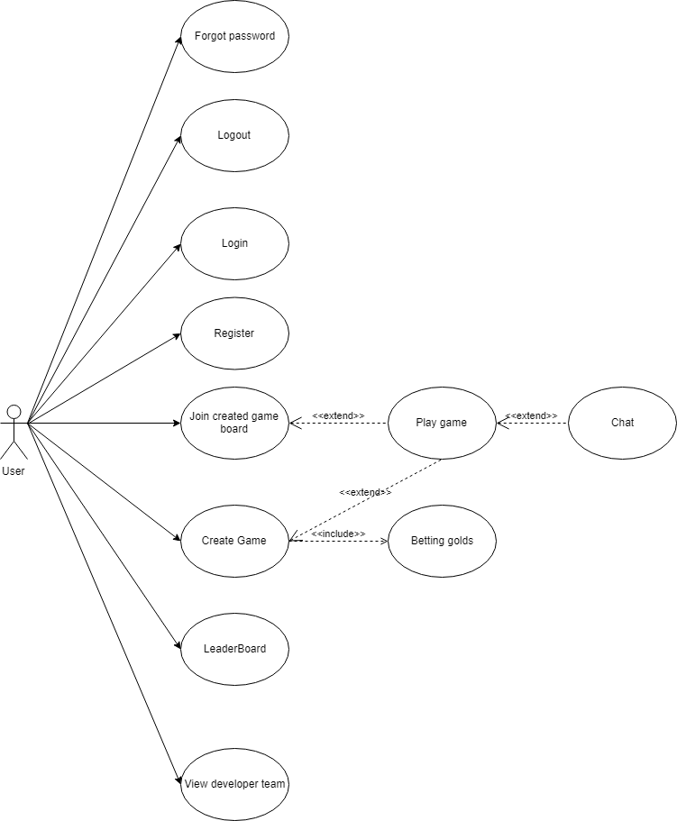

# Thathu caro 


- [Thathu caro](#thathu-caro)     
    - [Features](#features)     
    - [UseCase](#usecase)     
    - [Game constraints](#game-constraints)         
        - [Registry](#registry)         
        - [Create game board/ betting golds](#create-game-board-betting-golds)         
        - [Join game board](#join-game-board)         
        - [Playing game](#playing-game)         
        - [Chat when playing](#chat-when-playing)     
    - [REST API](#rest-api)         
        - [Register](#register)         
        - [Logout](#logout)         
        - [Login](#login)         
        - [Forgot password](#forgot-password)        
        - [Ranking](#ranking)         
        - [Create game](#create-game)         
        - [Get List Waiting game](#get-list-waiting-game)         
        - [Join Waiting game](#join-waiting-game)  
## Features

- Register
- Login
- Logout
- Forgot password
- View developer team
- Create game board
- Join created game board
- Play game between two users
- Leaderboard
- Betting golds
- Chat when playing


## UseCase



## Game constraints

### Registry

- username is unique
- email is unique
- each new user has 10.000 golds.


### Create game board/ betting golds

- Standard 15x15 grid.
- Current user must has logged in.
- Golds of current user must greater or equal than the betting golds of game board.
- An unique id will be auto created for current game board.

### Join game board

- Current user must has logged in.
- Current user golds must greater or equal than the betting golds of the game board.

### Playing game

- Game board will random who be the first, host (X) or opponent (O).
- Each time turn is limited with 20 seconds, if user do not play their turn, then that user lost.
- Winning state of user:
  - Not blocking in two heads
  - Exactly 5 patterns in 

### Chat when playing

- Chat with characters and emojis.

## REST API

### Register

POST /register

Request

```
body:{
	username: “a”,
	password: “b”
}
```

Response

```sh
Code 201: Created register succes
Code 400: Bad Request invalid username or password
Code 409: Conflict user exist
Code: 500:  Internal Server Error
```
### Logout

POST /logout

Request

```sh
body:{
	token: “token”
}
```

Response

```sh
code 200: OK
Code 400: Bad Request invalid token
Code: 500: Internal Server Error
```

### Login

POST /login

Request
```sh
body:{
	username: “a”,
	password: “b”
}
```

Response
```sh

Code 200: ok Login success

boody:{
	user: user,
	token: token
}
Code 400:  Bad Request invalid username or password

Code 409:  Conflict user loged

Code: 401: wrong username or password
```
### Forgot password

POST /forgotpassword

Request
```sh
body:{
	email: “email”,
	username: username
}
```

Response

```sh
Code 200: OK 

Code: 401: wrong username or email
```

### Ranking

GET /ranking

Request
`
header authorization: bearer token
`

Response

```sh
Code 200: OK
body:{
	user: []
}
Code 401: UNAUTHORIZED  wrong token
```

### Create game

POST /games

Request
`
header authorization: bearer token
`

```sh
body:{
	betting-gold: 2000
}
```

Response

```sh
Code 200:  OK
Code 500: Internal Server Error
Code 401: Unauthorized wrong token
```

### Get List Waiting game
GET /games

Request

`
header authorization: bearer token
`

Response

```sh
Code 200:  OK

Code 500: Internal Server Error

Code 401: Unauthorized wrong token
```

### Join Waiting game

GET /games/join

Request
`
header authorization: bearer token
`

Response
```sh
Code 200: OK

Code 500: Internal Server Error

Code 401: Unauthorized wrong token
```

